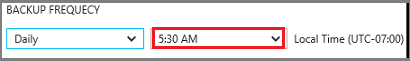

## Definizione di un criterio di backup

Criteri di backup definiscono una matrice di quando sono snapshot i dati e per quanto tempo vengono mantenute tali istantanee. Quando si definisce un criterio per il backup di una macchina virtuale, è possibile attivare un processo di backup *una volta al giorno*. Quando si crea un nuovo criterio, viene applicata all'archivio. L'interfaccia di criteri di backup è simile alla seguente:

Per creare un criterio:

1. Immettere un nome per il **nome del criterio**.

2. Intervalli giornaliera o settimanale possibile snapshot dei dati. Usare il menu a discesa **Frequenza di Backup** per scegliere se dati sono snapshot giornaliera o settimanale.

    - Se si sceglie un intervallo giornaliero, utilizzare il controllo evidenziato per selezionare l'ora del giorno per lo snapshot. Per cambiare l'ora, deselezionare l'ora e selezionare la nuova ora.

      

    - Se si sceglie un intervallo settimanale, usare i controlli evidenziati per selezionare i giorni della settimana e l'ora del giorno per creare lo snapshot. Nel menu giorno, selezionare uno o più giorni. Nel menu ora, selezionare un'ora. Per cambiare l'ora, deselezionare l'ora selezionato e selezionare la nuova ora.

    

3. Per impostazione predefinita, verranno selezionate tutte le opzioni di **Mantenimento dei dati** . Deselezionare eventuali limiti di intervallo di criteri di conservazione che non si desidera utilizzare. Specificare quindi interval(s) da utilizzare.

    Mensile e annuale gli intervalli di conservazione consentono di specificare le istantanee in base a un incremento giornaliero o settimana.

    >[AZURE.NOTE] Quando si protegge una macchina virtuale, un processo di backup viene eseguita una volta al giorno. Il tempo quando viene eseguito il backup è la stessa operazione per ogni intervallo di criteri di conservazione.

4. Dopo aver impostato tutte le opzioni per il criterio, nella parte superiore e il fare clic su **Salva**.

    Il nuovo criterio viene applicato immediatamente all'archivio.
