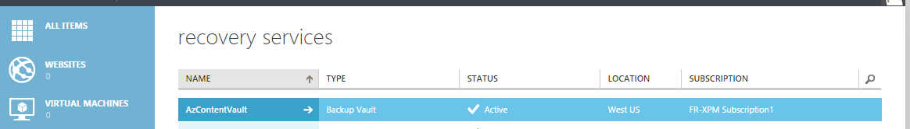

## Creare un archivio di Backup
Per eseguire il backup file e i dati da Windows Server o Data Protection Manager (DPM) in Azure o per eseguire il backup IaaS macchine virtuali di Azure, è necessario creare un archivio di backup nella propria area geografica in cui si desidera archiviare i dati.

La procedura seguente consentono all'utente la creazione dell'archivio utilizzato per archiviare i backup.

1. Accedere al [portale di gestione](https://manage.windowsazure.com/)
2. Fare clic su **Nuovo** > **ODS** > **Servizi di recupero** > **Archivio di Backup** e scegliere **Creazione rapida**.

    

3. Per il parametro **Name** , immettere un nome descrittivo per identificare l'archivio di backup. Questa operazione deve essere univoco per ogni sottoscrizione.

4. Per il parametro **area geografica** , selezionare la località geografica per l'archivio di backup. La scelta determina la propria area geografica in cui viene inviati i dati di backup. Se si sceglie un'area geografica vicino la posizione dell'utente, è possibile ridurre la latenza di rete per eseguire il backup di Azure.

5. Fare clic su **Crea archivio** per completare il flusso di lavoro. Può richiedere un po' di tempo per l'archivio di backup da creare. Per controllare lo stato, è possibile monitorare le notifiche nella parte inferiore del portale.

    

6. Dopo aver creato l'archivio di backup, un messaggio indica che l'archivio è stato creato correttamente. L'archivio specificato anche le risorse per i servizi di recupero come **attivo**.

    

### Backup Azure - opzioni relative all'archiviazione ridondanza

>[AZURE.IMPORTANT] L'orario migliore per identificare l'opzione ridondanza dello spazio di archiviazione è subito dopo la creazione di archivio e prima tutti i computer sono registrati nell'archivio. Una volta un elemento è stato registrato all'archivio, l'opzione ridondanza dello spazio di archiviazione è bloccato e non può essere modificata.

Le esigenze dell'organizzazione deve determinare la ridondanza di archiviazione dello spazio di archiviazione back-end Azure Backup. Se si utilizza Azure come un endpoint di archiviazione di backup principale (ad esempio, esegue il backup in Azure da un Server di Windows), è necessario prendere in considerazione rileva (impostazione predefinita) l'opzione di archiviazione ridondanti geografico. Questo è visualizzato sotto l'opzione **Configure** dell'archivio copia di Backup.

#### Spazio di archiviazione ridondanti geografico (GRS)
GRS mantiene sei copie dei dati. Con GRS, i dati vengono replicati tre volte all'interno dell'area principale e anche replicati tre volte in un'area secondaria centinaia di miglia all'esterno dell'area principale, fornire il massimo livello di durata. In caso di errore all'area principale, archiviazione dei dati in GRS, Azure Backup garantisce che i dati permanenti in due aree separate.

#### Spazio di archiviazione in locale ridondante (LRS)
Spazio di archiviazione in locale ridondante (LRS) mantiene tre copie dei dati. LRS viene replicato tre volte all'interno di una singola struttura un'area specifica. LRS consente di proteggere i dati da errori hardware normale, ma non in caso di errore di un'intera struttura Azure.

Se si utilizza Azure come un endpoint di terzo livello dello spazio di archiviazione backup (ad esempio si utilizza SCDPM per avere una copia di backup locale copia locale & con Azure per i criteri di conservazione a lungo termine esigenze), è consigliabile scegliere localmente lo spazio di archiviazione ridondanti dall'opzione **Configura** dell'archivio copia di Backup. Verrà visualizzato il costo di archiviazione dati di Azure, fornendo un livello inferiore di durata per i dati che potrebbero essere accettabili per le copie di terzo livello.

