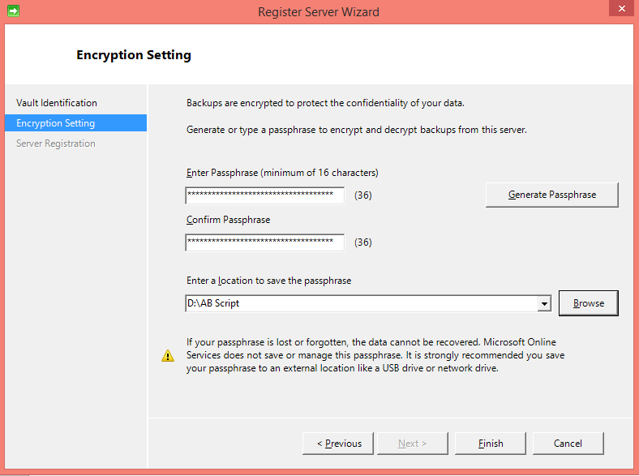

## Scaricare, installare e registrare l'agente di Backup di Azure

Dopo aver creato l'archivio di Backup di Azure, un agente dovrebbe essere installato in tutti i computer di Windows (Windows Server, client di Windows, System Center Data Protection Manager server o computer Server Backup Azure) che consente di eseguire il backup dei dati e alle applicazioni di Azure.

1. Accedere al [portale di gestione](https://manage.windowsazure.com/)

2. Fare clic su **Servizi di recupero**, quindi selezionare l'archivio di backup che si desidera eseguire la registrazione con un server. Verrà visualizzata la pagina Guida introduttiva per tale archivio di backup.

    

3. Nella pagina Guida introduttiva, selezionare l'opzione **per Windows Server o System Center Data Protection Manager o client di Windows** in **Agente di Download**. Fare clic su **Salva** per copiare sul computer locale.

    

4. Dopo aver installato l'agente, fare doppio clic su MARSAgentInstaller.exe per avviare l'installazione dell'agente di Backup di Azure. Scegliere la cartella di installazione e necessari per l'agente di nuova cartella. Il percorso della cache specificato deve essere disponibile spazio almeno 5% dei dati di backup.

5.  Se si usa un server proxy per la connessione a internet, nella schermata di **configurazione del Proxy** , immettere i dettagli di server proxy. Se si utilizza un proxy autenticato, immettere i dettagli di nome e una password utente in questa schermata.

6.  L'agente di Backup di Azure consente di installare Windows PowerShell e .NET Framework 4.5 (se non è disponibile già) per completare l'installazione.

7.  Dopo aver installato l'agente, fare clic sul pulsante di **procedere alla registrazione** per continuare con il flusso di lavoro.

    

8. Nella schermata di archivio delle credenziali, individuare e selezionare il file di archivio credenziali che in precedenza è stato scaricato.

    

    Il file di archivio credenziali è valido solo per 48 ore (dopo essere stato scaricato dal portale). Se si verifica un errore nella schermata (ad esempio "file di archivio credenziali disponibile è scaduto"), account di accesso al portale di Azure e scarica di nuovo il file di archivio credenziali.

    Assicurarsi che il file di archivio credenziali sia disponibile in un percorso accessibile tramite l'applicazione di installazione. Se si verificano problemi correlati di accesso, copiare il file di archivio credenziali in un percorso temporaneo nel computer in uso e ripetere l'operazione.

    Se si verifica un errore di credenziali archivio non valido (ad esempio "fornite le credenziali di archivio non valido") il file è danneggiato o non sono associati le credenziali più recenti con il servizio di recupero. Ripetere l'operazione dopo il download di un nuovo file di archivio credenziali dal portale. Questo errore solitamente si verifica se l'utente fa clic sull'opzione di **Download delle credenziali di archivio** nel portale di Azure, in rapida sequenza. In questo caso, solo secondo archivio credenziali file è valido.

9. Nella schermata di **impostazione di crittografia** , è possibile generare una frase o fornire una frase (minimo di 16 caratteri). È necessario ricordare di salvare la passphrase in un percorso sicuro.

    

    > [AZURE.WARNING] Se la passphrase viene persa o dimenticata; Microsoft non consente di ripristinare i dati di backup. L'utente finale proprietario passphrase crittografia Microsoft non sono visibili in passphrase utilizzata dall'utente finale. Salvare il file in un percorso sicuro come richiesto durante un'operazione di ripristino.

10. Quando si fa clic sul pulsante **Fine** , registrato correttamente il computer per l'archivio e ora si è pronti iniziare a backup Microsoft Azure.

11. Quando si usa Microsoft Azure Backup autonomo è possibile modificare le impostazioni specificate durante il flusso di lavoro di registrazione facendo clic sull'opzione di **Modificare le proprietà** in snap-in mmc Azure Backup.

    

    In alternativa, quando si utilizza Data Protection Manager, è possibile modificare le impostazioni specificate durante il flusso di lavoro di registrazione facendo clic sull'opzione **Configura** selezionando **Online** nella scheda **Gestione** .

    
