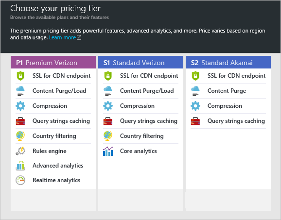

**Per creare un nuovo profilo di rete CDN**

1. Nel [Portale di Azure](https://portal.azure.com), in alto a sinistra, fare clic su **Nuovo**.  Nell'e **Nuovo** , selezionare **elementi multimediali + CDN**quindi **CDN**.

    Verrà visualizzata e il profilo CDN nuovo.

    

2. Immettere un nome per il proprio profilo CDN.

3. Selezionare un **percorso**.  Si tratta del percorso Azure in cui archiviare le informazioni del profilo CDN.  Non produce alcun effetto sui percorsi di rete CDN endpoint.

4. Selezionare o creare un **Gruppo di risorse**.  Per ulteriori informazioni sui gruppi di risorse, vedere [Panoramica di gestione di risorse Azure](resource-group-overview.md#resource-groups).

5. Selezionare un **livello di prezzi**.  Vedere la [Panoramica CDN](cdn-overview.md#azure-cdn-features) per un confronto dei prezzi livelli.
    
    

6. Selezionare l' **abbonamento** per il profilo CDN.

7. Fare clic sul pulsante **Crea** per creare il nuovo profilo. 