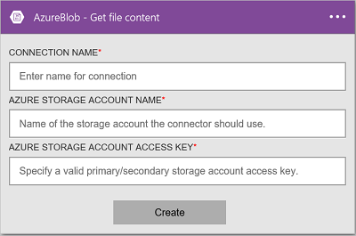

### Prerequisiti
- Un account Azure; è possibile creare un [account gratuito](https://azure.microsoft.com/free)
- Un [account di archiviazione Blob Azure](../articles/storage/storage-create-storage-account.md) incluso il nome dell'account di archiviazione e la relativa chiave di accesso. Queste informazioni sono riportate nelle proprietà dell'account di archiviazione nel portale di Azure. Altre informazioni [sull'Archiviazione Azure](../articles/storage/storage-introduction.md).

Prima di utilizzare l'account di archiviazione Blob Azure in un'app di logica, connettersi al proprio account di archiviazione Blob Azure. È possibile eseguire questa operazione facilmente all'interno dell'applicazione di logica nel portale di Azure.  

Connettersi al proprio account di archiviazione Blob Azure procedendo come segue:  

1. Creare un'app di logica. Nella finestra di progettazione logica App, aggiungere un trigger e quindi aggiungere un'azione. Selezionare **Mostra Microsoft API gestite** nell'elenco a discesa e quindi immettere "blob" nella casella di ricerca. Selezionare una delle operazioni:  

      

2. Se è stata creata in precedenza tutte le connessioni allo spazio di archiviazione Azure, verrà richiesto per i dettagli della connessione:   

      

3. Immettere i dettagli di account di archiviazione. Proprietà con un asterisco sono obbligatorie.

    | Proprietà | Dettagli |
|---|---|
| Nome della connessione * | Immettere un nome per la connessione. |
| Nome dell'Account di archiviazione Azure * | Immettere il nome dell'account di archiviazione. Nelle proprietà dello spazio di archiviazione nel portale di Azure viene visualizzato il nome dell'account di archiviazione. |
| Tasto di scelta Account Azure dello spazio di archiviazione * | Immettere la chiave account lo spazio di archiviazione. Tasti di scelta vengono visualizzati nelle proprietà dello spazio di archiviazione nel portale di Azure. |

    Queste credenziali vengono utilizzate per autorizzare l'app logica connettersi e accedere ai dati. 

4. Selezionare **Crea**.

5. Si noti che la connessione è stata creata. A questo punto, procedere con gli altri passaggi nell'app logica: 

      
