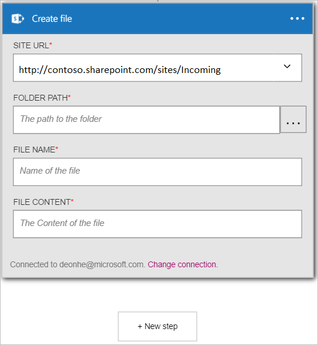

Dopo avere aggiunto un trigger, l'ora di eseguire un'azione interessanti con i dati che viene generati dal trigger. Seguire questa procedura per aggiungere un'azione **SharePoint Online - creare file** . Questa azione verrà creato un file in SharePoint Online ogni volta che viene generato il nuovo trigger di elemento. 

Per configurare questa azione, sarà necessario fornire le informazioni seguenti. Si noterà che è facile da usare dati generati dal trigger come input per alcune delle proprietà per il nuovo file:

|Creare proprietà del file|Descrizione|
|---|---|
|URL del sito|Questo è l'URL del sito di SharePoint Online in cui si vuole creare il nuovo file. Selezionare il sito dall'elenco visualizzato.|
|Percorso della cartella|Si tratta della cartella (all'URL del sito) in cui verrà inserito il nuovo file. Cercare e selezionare la cartella.|
|Nome del file|Questo è il nome del file da creare.|
|Contenuto del file|Il contenuto che verrà scritti al file.|

1. Selezionare **+ nuova azione** per aggiungere l'azione.  
  
- Selezionare il collegamento **Aggiungi un'azione** . Verrà visualizzata la casella di ricerca in cui è possibile cercare qualsiasi azione si desidera eseguire. In questo esempio, le azioni di SharePoint sono di interesse.    
    
- Immettere *sharepoint* per eseguire una ricerca per le azioni correlate in SharePoint.
- Selezionare **SharePoint Online - creare file** come l'azione da eseguire.   **Nota**: verrà richiesto di autorizzare l'app logica per accedere all'account di SharePoint se si è già stato in precedenza.    
    
- Si apre la **creazione di un file** .   
     
- Selezionare **L'URL del sito** e individuare il sito in cui si desidera creare il file.     
  
- Selezionare **percorso della cartella** e individuare la cartella in cui verrà inserito il nuovo file.  
  
- Selezionare il controllo **del nome di File** e immettere il nome del file che si desidera creare. Per il nome del file, si noterà che è possibile utilizzare le proprietà da trigger creato in precedenza, è sufficiente selezionare dall'elenco visualizzato.     
  
- Selezionare il controllo **contenuto del File** e immettere il contenuto che verrà scritti il file che verrà creato. Per il contenuto del file, si noterà che è possibile utilizzare le proprietà da trigger creato in precedenza. È sufficiente selezionare le proprietà dall'elenco visualizzato. In alternativa, è possibile immettere il testo **contenuto del File** direttamente nel controllo. In questo esempio selezionata alcune proprietà e aggiungere gli spazi e inserire un trattino tra ogni proprietà.        
  
- Salvare le modifiche al flusso di lavoro  
