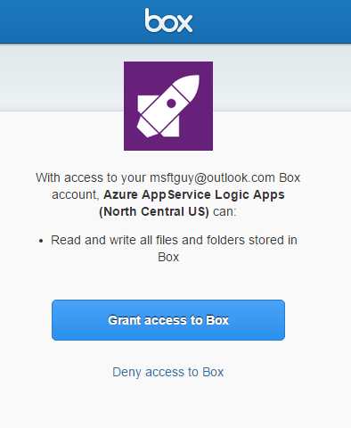

### Prerequisiti

- Un account di [casella](http://box.com)  

Prima di poter usare l'account di casella in un'app di logica, è necessario autorizzare l'app di logica per connettersi al proprio account di casella. Per tale operazione può essere facilmente all'interno dell'applicazione di logica nel portale di Azure.  

Ecco i passaggi per autorizzare l'app logica per connettersi al proprio account casella:  
1. Per creare una connessione alla casella, nella finestra di progettazione di app logica, selezionare **Mostra Microsoft API gestite** nell'elenco a discesa, quindi *Immettere nella casella di ricerca* . Selezionare il trigger o l'azione desiderata da usare:  
  
2. Se è stata creata tutte le connessioni in una casella prima, verrà viene richiesto di specificare le credenziali di casella. Queste credenziali verranno usate per autorizzare l'app logica a cui connettersi e accedere ai dati del proprio account casella:  
  
3. Specificare il nome utente casella e la password per autorizzare l'app logica:  
   
4. Consente di connettersi alla casella:  
  
5. Si noti la connessione è stata creata, l'ora gratuito procedere con gli altri passaggi nell'app logica:  
  
