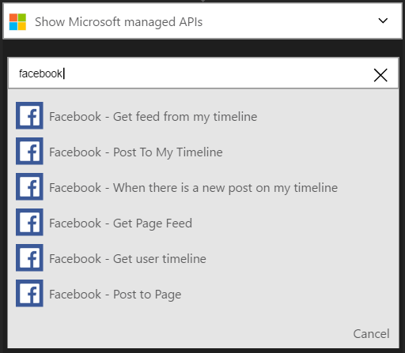
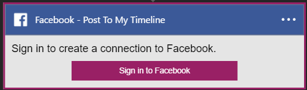

### Prerequisiti di
- Un account di [Facebook](https://www.facebook.com/) 

Prima di poter usare il proprio account Facebook in un'app di logica, è necessario autorizzare l'app logica per connettersi all'account Facebook. Per tale operazione può essere facilmente all'interno dell'applicazione di logica nel portale di Azure. 

Ecco i passaggi per autorizzare l'app logica per connettersi all'account Facebook:

1. Per creare una connessione a Facebook, nella finestra di progettazione di app logica, selezionare **Mostra Microsoft API gestite** nell'elenco a discesa, quindi immettere *Facebook* nella casella di ricerca. Selezionare il trigger o l'azione desiderata da usare:  
  
2. Se è stata creata tutte le connessioni a Facebook prima, verrà viene richiesto di specificare le credenziali di Facebook. Queste credenziali verranno usate per autorizzare l'app logica a cui connettersi e accedere ai dati del proprio account Facebook:  
  
3. Specificare il nome utente di Facebook e la password per autorizzare l'app logica:  
     
4. Si noti la connessione è stata creata, l'ora gratuito procedere con gli altri passaggi nell'app logica:  
     
