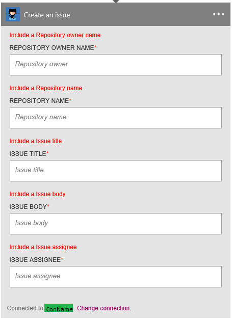

### Prerequisiti di
- Un account [GitHub](http://GitHub.com) 

Prima di poter usare l'account GitHub in un'app di logica, è necessario autorizzare l'app di logica per connettersi al proprio account GitHub. Per tale operazione può essere facilmente all'interno dell'applicazione di logica nel portale di Azure. 

Ecco i passaggi per autorizzare l'app logica per connettersi al proprio account GitHub:

1. Per creare una connessione a GitHub, nella finestra di progettazione di app logica, selezionare **Mostra Microsoft API gestite** nell'elenco a discesa, quindi immettere *GitHub* nella casella di ricerca. Selezionare il trigger o l'azione desiderata da usare:  
  
2. Se è stata creata tutte le connessioni a GitHub prima, verrà viene richiesto di specificare le credenziali GitHub. Queste credenziali verranno usate per autorizzare l'app logica a cui connettersi e accedere ai dati del proprio account GitHub:  
  
3. Specificare il nome utente GitHub e la password per autorizzare l'app logica:  
     
4. Di conferma:  
     
5. Si noti che la connessione è stata creata nel portale. È ora possibile procedere con l'app di logica di creazione e utilizzo di GitHub al suo interno:   
     
