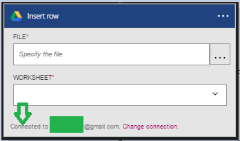

### Prerequisiti

- Un account [GoogleDrive](https://www.google.com/drive/)  

Prima di poter usare l'account GoogleDrive in un'app di logica, è necessario autorizzare l'app logica per connettersi al proprio account GoogleDrive. Per tale operazione può essere facilmente all'interno dell'applicazione di logica nel portale di Azure.  

Ecco i passaggi per autorizzare l'app di logica per connettersi al proprio account GoogleDrive:  
1. Per creare una connessione a GoogleDrive, nella finestra di progettazione di app logica, selezionare **Mostra Microsoft API gestite** nell'elenco a discesa, quindi immettere *GoogleDrive* nella casella di ricerca. Selezionare il trigger o l'azione desiderata da usare:  
  
2. Se è stata creata tutte le connessioni a GoogleDrive prima, verrà viene richiesto di specificare le credenziali GoogleDrive. Queste credenziali verranno utilizzate per autorizzare l'app logica a cui connettersi e accedere ai dati del proprio account GoogleDrive:  
  
3. Specificare l'indirizzo di posta elettronica GoogleDrive:  
   
4. Immettere la password GoogleDrive per autorizzare l'app logica:  

5. Consente la connessione a GoogleDrive  
  
6. Si noti la connessione è stata creata, l'ora gratuito procedere con gli altri passaggi nell'app logica:  
  

