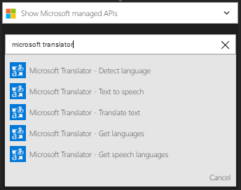
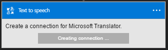

### Prerequisiti

- Un account [MicrosoftTranslator](https://www.microsoft.com/translator)  

Prima di poter usare l'account MicrosoftTranslator in un'app di logica, è necessario autorizzare l'app logica per connettersi al proprio account MicrosoftTranslator. Per tale operazione può essere facilmente all'interno dell'applicazione di logica nel portale di Azure.  

Ecco i passaggi per autorizzare l'app di logica per connettersi al proprio account MicrosoftTranslator:  
1. Per creare una connessione a MicrosoftTranslator, nella finestra di progettazione di app logica, selezionare **Mostra Microsoft API gestite** nell'elenco a discesa, quindi immettere *MicrosoftTranslator* nella casella di ricerca. Selezionare il trigger o l'azione desiderata da usare:  
  
2. Se è stata creata tutte le connessioni a MicrosoftTranslator prima, verrà viene richiesto di specificare le credenziali MicrosoftTranslator. Queste credenziali verranno utilizzate per autorizzare l'app logica a cui connettersi e accedere ai dati del proprio account MicrosoftTranslator:  
  
3. Si noti la connessione è stata creata, l'ora gratuito procedere con gli altri passaggi nell'app logica:  
   
