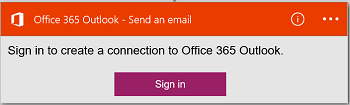

#### Prerequisiti di
- Un account Azure; è possibile creare un [account gratuito](https://azure.microsoft.com/free)
- Un account [Office 365](https://office365.com)  

Prima di utilizzare l'account Office 365 in un'app di logica, autorizzare l'app logica per connettersi al proprio account Office 365. È possibile eseguire questa operazione facilmente all'interno dell'applicazione di logica nel portale di Azure.  

Autorizzare l'app logica per connettersi al proprio account di Office 365 eseguendo la procedura seguente:

1. Creare un'app di logica. Nella finestra di progettazione logica App, selezionare **Mostra Microsoft API gestite** nell'elenco a discesa e quindi immettere "office 365" nella casella di ricerca. Selezionare una delle azioni trigger:  
      

2. Se è stata creata in precedenza tutte le connessioni a Office 365, viene chiesto di accedere con le credenziali di Office 365:  
      

3. Selezionare **l'accesso**e immettere il nome utente e la password. Selezionare **l'accesso**:  
    

    Queste credenziali vengono utilizzate per autorizzare l'app di logica di connettersi e accedere all'account di Office 365. 

4. Si noti che la connessione è stata creata. A questo punto, procedere con gli altri passaggi nell'app logica:   
      
  