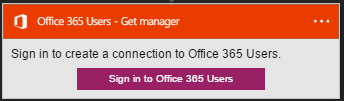
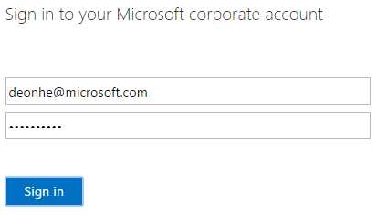
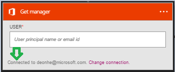

### Prerequisiti di

- Un account di [Utenti di Office 365](https://office365.com)  

Prima di poter usare l'account di utenti di Office 365 in un'app di logica, è necessario autorizzare l'app logica per connettersi al proprio account di utenti di Office 365. Per tale operazione può essere facilmente all'interno dell'applicazione di logica nel portale di Azure.  

Ecco i passaggi per autorizzare l'app logica per connettersi al proprio account di utenti di Office 365:  
1. Per creare una connessione a utenti di Office 365, nella finestra di progettazione di app logica, selezionare **Mostra Microsoft API gestite** nell'elenco a discesa, quindi immettere *Gli utenti di Office 365* nella casella di ricerca. Selezionare il trigger o l'azione desiderata da usare:  
  
2. Se è stata creata tutte le connessioni agli utenti di Office 365 prima, verrà viene richiesto di specificare le credenziali di utenti di Office 365. Queste credenziali verranno usate per autorizzare l'app logica a cui connettersi e accedere ai dati del proprio account Office 365 utenti:  
  
3. Specificare il nome utente gli utenti di Office 365 e la password per autorizzare l'app logica:  
   
4. Si noti la connessione è stata creata, l'ora gratuito procedere con gli altri passaggi nell'app logica:  
  
  