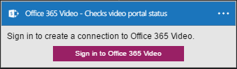

### Prerequisiti di

- Un account [Office 365 Video](https://support.office.com/article/Meet-Office-365-Video-ca1cc1a9-a615-46e1-b6a3-40dbd99939a6)  

Prima di poter usare l'account di Office 365 Video in un'app di logica, è necessario autorizzare l'app logica per connettersi al proprio account Office 365 Video. Per tale operazione può essere facilmente all'interno dell'applicazione di logica nel portale di Azure.  

Ecco i passaggi per autorizzare l'app logica per connettersi al proprio account Office 365 Video:  
1. Per creare una connessione a Office 365 Video, nella finestra di progettazione di app logica, selezionare **Mostra Microsoft API gestite** nell'elenco a discesa, quindi immettere *Office 365 Video* nella casella di ricerca. Selezionare il trigger o l'azione desiderata da usare:  
  
2. Se è stata creata tutte le connessioni a Office 365 Video prima, verrà viene richiesto di specificare le credenziali di Office 365 Video. Queste credenziali verranno usate per autorizzare l'app logica a cui connettersi e accedere ai dati del proprio account Office 365 Video:  
  
3. Specificare le credenziali per connettersi a Office 365 Video:  
   
4. Si noti la connessione è stata creata, l'ora gratuito procedere con gli altri passaggi nell'app logica:  
  
