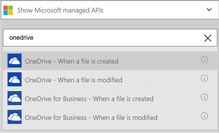

#### Prerequisiti
- Un account Azure; è possibile creare un [account gratuito](https://azure.microsoft.com/free)
- Un account di [OneDrive](https://www.microsoft.com/store/apps/onedrive/9wzdncrfj1p3) 

Prima di poter usare l'account di OneDrive in un'app di logica, autorizzare l'app logica per connettersi al proprio account di OneDrive.  È possibile eseguire questa operazione facilmente all'interno dell'applicazione di logica nel portale di Azure. 

Autorizzare l'app logica per connettersi al proprio account OneDrive procedendo come segue:

1. Creare un'app di logica. Nella finestra di progettazione logica App, selezionare **Mostra Microsoft API gestite** nell'elenco a discesa e quindi immettere "onedrive" nella casella di ricerca. Selezionare uno dei trigger o azioni:  
  
2. Se è stata creata in precedenza tutte le connessioni a OneDrive, viene chiesto di accedere con le credenziali di OneDrive:  
  
3. Selezionare **l'accesso**e immettere il nome utente e la password. Selezionare **l'accesso**:  
     

    Queste credenziali vengono utilizzate per autorizzare l'app di logica di connettersi e accedere ai dati nel proprio account di OneDrive. 
4. Selezionare **Sì** per autorizzare l'app logica usare l'account di OneDrive:  
     
5. Si noti che la connessione è stata creata. A questo punto, procedere con gli altri passaggi nell'app logica:  
  
