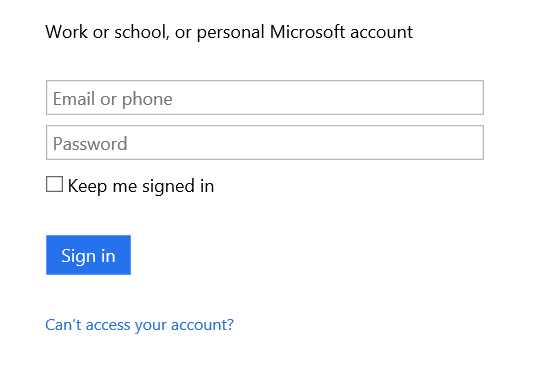

### Prerequisiti
- Un account di [OneDrive](http://OneDrive.com) 

Prima di poter utilizzare OneDrive per conto di Business in un'app di logica, è necessario autorizzare l'app logica per la connessione per l'account OneDrive for Business. Per tale operazione può essere facilmente all'interno dell'applicazione di logica nel portale di Azure. 

Ecco i passaggi per autorizzare l'app logica per la connessione per l'account OneDrive for Business:

1. Per creare una connessione a OneDrive for Business, nella finestra di progettazione di app logica, selezionare **Mostra Microsoft API gestite** nell'elenco a discesa, quindi immettere *OneDrive for Business* nella casella di ricerca. Selezionare il trigger o l'azione desiderata da usare:  
  
2. Se è stata creata tutte le connessioni a OneDrive for Business prima, verrà visualizzato richiesto per fornire OneDrive per le credenziali di Business. Queste credenziali verranno usate per autorizzare l'app logica a cui connettersi e accedere a OneDrive per i dati dell'account Business:  
  
3. Specificare la OneDrive for Business utente nome e la password per autorizzare l'app logica:  
     
4. Si noti la connessione è stata creata, l'ora gratuito procedere con gli altri passaggi nell'app logica:  
     
