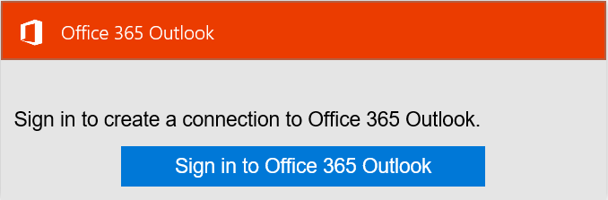

## Connettersi a Outlook.com

### Prerequisiti
- Un account Outlook.com

Prima di poter usare l'account Outlook.com in un'app di logica, è necessario autorizzare l'app logica per connettersi al proprio account Outlook.com. Per tale operazione può essere facilmente all'interno dell'applicazione di logica nel portale di Azure. 

Ecco i passaggi per autorizzare l'app logica per connettersi al proprio account Outlook.com:

1. Tutte le app logica è necessario essere avviati da un trigger in modo che dopo aver creato l'app logica, apertura della finestra di progettazione e visualizza un elenco di trigger che è possibile utilizzare per avviare l'app logica:

  
2. Immettere "outlook" nella casella di ricerca. Si noti che l'elenco viene filtrato per elencare tutti i trigger con "Outlook" nel nome:
3. Selezionare **Office 365 Outlook - nel nuovo messaggio di posta elettronica**.   
  Se è stata creata tutte le connessioni a Outlook prima, verrà viene richiesto di specificare le credenziali di Outlook.com. Queste credenziali verranno usate per autorizzare l'app logica a cui connettersi e accedere ai dati dell'account Outlook.com:
4. Specificare le credenziali per Outlook e l'accesso:  
  Questo è tutto. A questo punto è stata creata una connessione a Outlook. La connessione sarà disponibile per l'uso in qualsiasi altra app logica creata.

