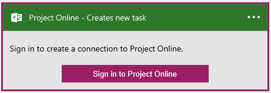

### Prerequisiti
- Un account di [Project Online](https://products.office.com/Project/project-online-with-project-for-office-365) 

Prima di poter usare l'account di Project Online in un'app di logica, è necessario autorizzare l'app di logica per connettersi al proprio account di Project Online. Per tale operazione può essere facilmente all'interno dell'applicazione di logica nel portale di Azure. 

Ecco i passaggi per autorizzare l'app logica per connettersi al proprio account di Project Online:

1. Per creare una connessione a Project Online, nella finestra di progettazione di app logica, selezionare **Mostra Microsoft API gestite** nell'elenco a discesa, quindi immettere *Project Online* nella casella di ricerca. Selezionare il trigger o l'azione desiderata da usare:  
  
2. Se è stata creata tutte le connessioni a Project Online prima, verrà viene richiesto di specificare le credenziali di Project Online. Queste credenziali verranno usate per autorizzare l'app logica a cui connettersi e accedere ai dati del proprio account di Project Online:  
  
3. Specificare il nome utente di Project Online e la password per autorizzare l'app logica:  
     
4. Si noti la connessione è stata creata, l'ora gratuito procedere con gli altri passaggi nell'app logica:  
     
