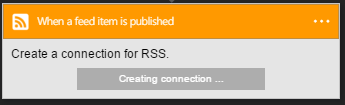

### Prerequisiti

- Un account [RSS](https://wikipedia.org/wiki/RSS)  

Prima di poter usare l'account RSS in un'app di logica, è necessario autorizzare l'app logica per connettersi al proprio account RSS. Per tale operazione può essere facilmente all'interno dell'applicazione di logica nel portale di Azure.  

Ecco i passaggi per autorizzare l'app logica per connettersi al proprio account RSS:  
1. Per creare una connessione a RSS, nella finestra di progettazione di app logica, selezionare **Mostra Microsoft API gestite** nell'elenco a discesa, quindi immettere *RSS* nella casella di ricerca. Selezionare il trigger o l'azione desiderata da usare:  
  
2. Selezionare **Crea connessione** :  
  
3. Si noti la connessione è stata creata, l'ora gratuito procedere con gli altri passaggi nell'app logica:  
   
