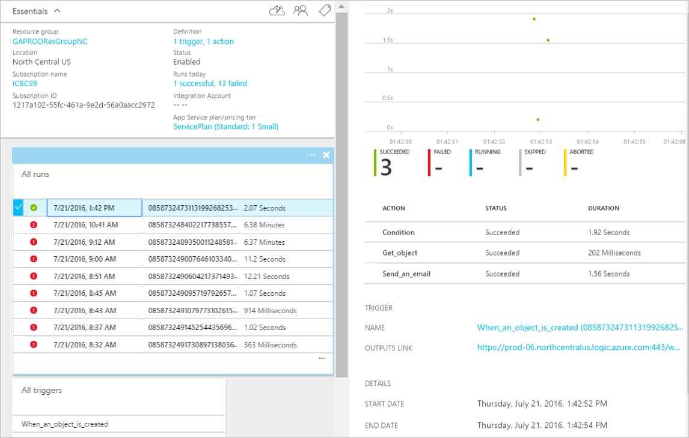

Dopo avere aggiunto una condizione, l'ora di eseguire un'azione interessanti con i dati che viene generati dal trigger. Seguire questa procedura per aggiungere l'azione **Salesforce - ottenere oggetto** . Questa azione otterrà i dati ogni volta che viene creato un nuovo cliente potenziale. Si aggiungeranno inoltre una seconda azione che verrà utilizzato i dati da Salesforce - ottenere un'azione oggetto per inviare un messaggio di posta elettronica utilizzando il connettore di Office 365.  

Per configurare questa azione, sarà necessario fornire le informazioni seguenti. Si noterà che è facile da usare dati generati dal trigger come input per alcune delle proprietà per il nuovo file:

|Creare proprietà del file|Descrizione|
|---|---|
|Tipo di oggetto|Si tratta del tipo di oggetto Salesforce che interessa. Esempi sono Lead, Account e così via.|
|ID oggetto|Questo rappresenta un identificatore per l'oggetto.|

1. Selezionare il collegamento **Aggiungi un'azione** . Verrà visualizzata la casella di ricerca in cui è possibile cercare qualsiasi azione si desidera eseguire. In questo esempio Salesforce azioni sono di interesse.      
  
- Immettere *salesforce* la ricerca per le azioni correlate salesforce.
- Selezionare **Salesforce - ottenere oggetto** come l'azione da eseguire.   **Nota**: verrà richiesto di autorizzare l'app logica per accedere all'account di Salesforce se si è già stato in precedenza.    
    
- Apre il controllo di **ottenere l'oggetto** .  
- Selezionare il *cliente potenziale* come tipo di oggetto.
- Selezionare il controllo **ID oggetto** .
- Selezionare **…** per espandere l'elenco di token che possono essere utilizzati come input per le azioni.       
    
- Verrà visualizzata la finestra di controllo **ID cliente potenziale** selezionato.   
     
- Si noti che il token ID cliente potenziale diventa nel controllo oggetto ID, che indica che l'azione oggetto Get cercherà un cliente potenziale con un ID che corrisponde all'ID cliente potenziale del cliente potenziale che lo ha attivato questa app logica.  
  
- Salvare il lavoro. Ecco fatto, aggiunti all'azione oggetto Get logica all'applicazione in uso. Il controllo oggetto Get dovrebbe risultare analoga alla seguente:    
  

Dopo aver aggiunto un'azione per ottenere un cliente potenziale, è consigliabile eseguire operazioni interessanti con lead appena creato. In un'organizzazione, può essere necessario inviare un messaggio di posta elettronica per ricevere una notifica una lista di distribuzione che è stato creato un nuovo cliente potenziale. Utilizzare il connettore di Office 365 per inviare un messaggio di posta elettronica con alcune informazioni pertinenti dal nuovo oggetto di cliente potenziale Salesforce.  

1. Selezionare **Aggiungi un'azione** , quindi immettere *posta elettronica* nel controllo di ricerca. Consente di filtrare le azioni a quelle relative all'invio e ricezione di posta elettronica.  
- Selezionare la voce di elenco di **Office 365 Outlook - inviare un messaggio di posta elettronica** . Se è già stata creata una *connessione* all'account Office 365, verrà richiesto di immettere le credenziali di Office 365 per creare ora. Al termine, verrà visualizzata la finestra di controllo **Invia messaggio di posta elettronica** .        
  
- Immettere l'indirizzo di posta elettronica che si desidera inviare messaggi di posta elettronica in **al** controllo.
-  In controllo **oggetto** immettere *Nuovo Lead creato* , quindi selezionare il token di *società* . Verrà visualizzato il campo *della società* dal nuovo cliente potenziale creato in Salesforce.  
-  Nel **corpo del** controllo, è possibile selezionare tutti i token dal nuovo cliente potenziale oggetto ed è inoltre possibile immettere il testo che si desidera visualizzare nel corpo del messaggio di posta elettronica. Ecco un esempio:  
   
- Salvare il flusso di lavoro.  

Questo è tutto. L'app logica è stata completata.  

A questo punto, è possibile testare l'app logica: in Salesforce, creare un nuovo cliente potenziale che soddisfa la condizione è stato creato.  Dopo avere eseguito di seguito sono illustrati completamente, dopo aver creato un cliente potenziale con un indirizzo di posta elettronica che contiene *amazon.com* al suo interno. Dopo alcuni secondi l'app logica deve essere attivata e i risultati potrebbero essere simili alla seguente:  
  

