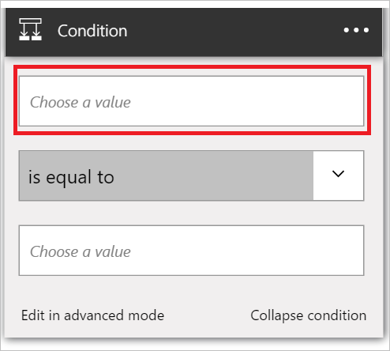

Questa condizione verrà valutata il campo indirizzo di posta elettronica di ogni nuovo cliente potenziale Salesforce. Se l'indirizzo di posta elettronica contiene *amazon.com*, il risultato condizione sarà *True*.

1. Selezionare **+ nuova azione**.  
   
- Selezionare **Aggiungi una condizione**.    
  
- Selezionare **un valore**.    
  
- Selezionare il token di *posta elettronica* dal cliente potenziale del trigger.    
  
- Selezionare *contiene*.      
  
- Selezionare **Scegli un valore** nella parte inferiore del controllo.     
  
- Immettere il valore che si desidera valutare l'indirizzo di posta elettronica del nuovo cliente potenziale per *amazon.com* . Se l'indirizzo di posta elettronica contiene *amazon.com*, la condizione restituirà *vero* e gli altri passaggi nell'app logica procedere.    
  
- Salvare le app logica.  

