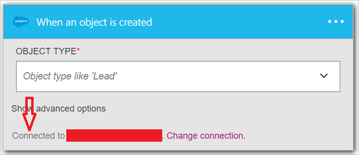

In questa procedura si imparerà a utilizzare trigger **Salesforce - quando viene creato un oggetto** per avviare un flusso di lavoro app logica quando viene creato un nuovo cliente potenziale nel Salesforce.

>[AZURE.NOTE]Verrà chiesto di accedere all'account Salesforce se non si è già creato una *connessione* a Salesforce.  

1. Immettere *salesforce* nella casella di ricerca nella finestra di progettazione di applicazioni logica, quindi selezionare il trigger **Salesforce - quando viene creato un oggetto** .  
   
- Il controllo **quando viene creato un oggetto** viene visualizzato.  
   
- Selezionare il **Tipo di oggetto** , quindi selezionare *Lead* dall'elenco degli oggetti. In questo passaggio si indica che si sta creando un trigger che invierà una notifica ogni volta che viene creato un nuovo cliente potenziale in Salesforce l'app logica.   
   
- Questo è tutto. È stata creata la condizione di attivazione. Tuttavia, è necessario creare almeno un'azione per impostare un'app logica valido.    
   

A questo punto, l'app logica è stato configurato con un trigger che verrà avviata l'esecuzione di altro trigger e azioni del flusso di lavoro quando viene creato un nuovo elemento nel Salesforce.  