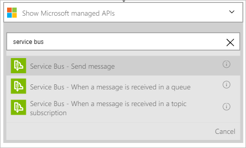

Dopo avere aggiunto un trigger, è possibile effettuare un'operazione con i dati che viene generati dal trigger. Seguire questa procedura per aggiungere l'azione **Bus di servizio - Invia messaggio** . Questa azione Invia un messaggio al servizio Bus.  

Seguire questa procedura per creare l'azione di invio messaggi:  

1. Selezionare **+ nuova azione** per aggiungere l'azione.  
- Selezionare **Aggiungi un'azione**. Verrà visualizzata una casella di ricerca, in cui è possibile cercare qualsiasi azione si desidera eseguire. In questo esempio, le azioni Bus di servizio sono di interesse.    
   
- Immettere *bus di servizio*.  
- Selezionare **Bus di servizio - Invia messaggio** come l'azione da eseguire.  
    
- Immettere il contenuto del messaggio. È necessario.  
- Immettere il nome di coda o l'argomento a cui il messaggio verrà inviato. È anche necessario.   
- Specificare altri dettagli relativi al messaggio. Questo è facoltativo.     
    
- Salvare le modifiche al flusso di lavoro.   
     
