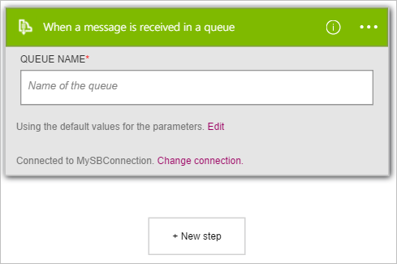

Di seguito viene illustrato come utilizzare il **Servizio Bus - quando si riceve un messaggio in una coda** di trigger per avviare un flusso di lavoro app logica quando un nuovo elemento viene inviato a una coda Bus di servizio.  

>[AZURE.NOTE]Verrà richiesto di accedere con la stringa di connessione Bus di servizio se non si è già creato una connessione al servizio Bus.  

1. Nella casella di ricerca nella finestra di progettazione di applicazioni logica immettere **bus di servizio**. Selezionare quindi il trigger **Servizio Bus - quando si riceve un messaggio in una coda** .  
   
- Viene visualizzata la finestra di dialogo **quando si riceve un messaggio in una coda** .  
   
- Immettere il nome della coda Bus di servizio che si preferisce trigger per monitorare.   
   

A questo punto, l'app logica è stato configurato con un trigger. Quando si riceve un nuovo elemento in coda che è selezionata, il trigger verrà avviata un'esecuzione di altro trigger e azioni del flusso di lavoro.    
