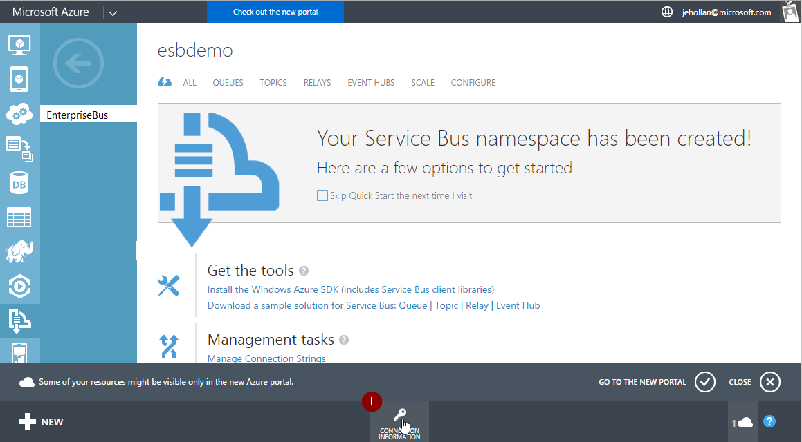
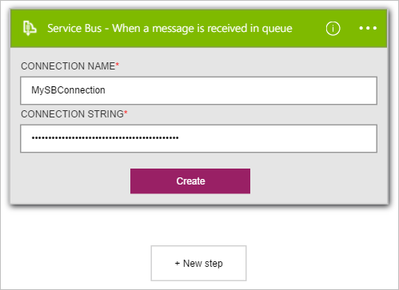

### Prerequisiti

È necessario disporre di un account di [Servizio Bus](https://azure.microsoft.com/services/service-bus/) .  

Prima di poter usare l'account Azure servizio Bus in un'app di logica, è necessario autorizzare l'app logica per connettersi al proprio account di servizio bus. Per tale operazione può essere facilmente all'interno dell'applicazione di logica nel portale di Azure.  

Ecco i passaggi per autorizzare l'app logica per connettersi al proprio account di servizio Bus:  

1. Per creare una connessione al servizio Bus, nella finestra di progettazione di app logica, selezionare **Mostra Microsoft API gestite** nell'elenco a discesa. Immettere quindi **bus servizio** nella casella di ricerca. Selezionare i trigger di azione che si desidera utilizzare.  
      

2. Se è stata creata tutte le connessioni al servizio Bus prima, verrà richiesto di specificare le credenziali Bus di servizio. Queste credenziali vengono utilizzate per autorizzare l'app di logica di connettersi e accedere ai dati dell'account del servizio Bus. Il connettore Bus di servizio deve la stringa di connessione per lo spazio dei nomi Bus di servizio. È inoltre necessario **gestire** le autorizzazioni. Un buon modo per sapere se la stringa di connessione è per lo spazio dei nomi o un'entità specifica se contiene la `EntityPath` parametro. In caso affermativo, non è la stringa di connessione appropriata per un'app di logica.  
    

1. Dopo aver ricevuto la stringa di connessione per lo spazio dei nomi, è possibile utilizzare per la connessione all'API nelle App logica.  
      

3. Si noti la connessione è stata creata e si è ora gratuito procedere con gli altri passaggi nell'app logica.  
       
