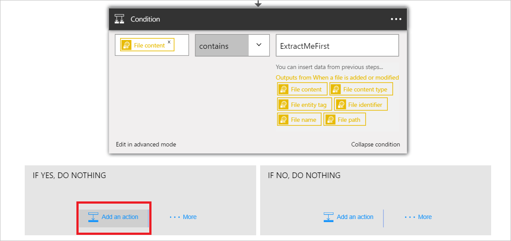
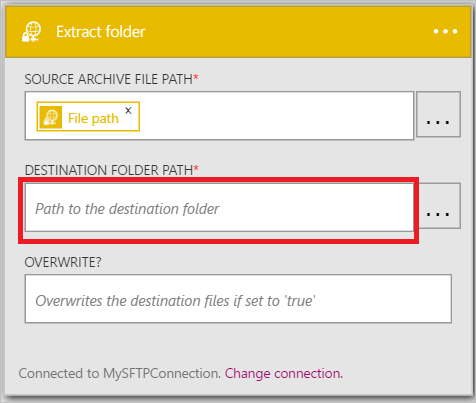

Dopo avere aggiunto un trigger, l'ora di eseguire un'azione interessanti con i dati che viene generati dal trigger. Seguire questa procedura per aggiungere un'azione **SFTP - cartella estratto** . Questa azione verrà estratto il contenuto di un file se vengono soddisfatte le condizioni definite. 

Per configurare questa azione, sarà necessario fornire le informazioni seguenti. Si noterà che è facile da usare dati generati dal trigger come input per alcune delle proprietà per il nuovo file:

|SFTP - proprietà della cartella di estrazione|Descrizione|
|---|---|
|Percorso del file di archivio di origine|Questo è il percorso del file estratti. È possibile selezionare uno dei token da un'azione precedente o esplorare il server SFTP per trovare il percorso del file.|
|Percorso della cartella di destinazione|Questo è il percorso in cui verranno inseriti i file estratti. È possibile selezionare uno dei token da un'azione precedente come percorso di destinazione o esplorare il server SFTP e selezionare un percorso.|
|Sovrascrivere?|Indica se un file con lo stesso nome del file estratto è stato trovato nel percorso della cartella di destinazione se il file esistente deve essere sovrascritti o meno.|

Entriamo nel mondo aggiungendo l'azione per estrarre i file, se la condizione definita in precedenza restituisce *True*. 

1. Selezionare **Aggiungi un'azione**.        
   
- Selezionare l'azione **SFTP - cartella di estrazione**      
   
- Selezionare **il percorso di file di origine archivio**              
   
- Selezionare il **percorso del File** di token. Indica che verrà utilizzato il percorso del file che ha rilevato il trigger come il percorso del file di archivio di origine.           
   
- Selezionare **il percorso di cartella di destinazione**           
   
- Selezionare il **percorso del File** di token. Indica che si utilizzerà il percorso del file che ha rilevato il trigger come percorso di destinazione per i file estratti.   
- Immettere *\ExtractedFile* nel controllo **percorso cartella di destinazione** . Ripetere l'operazione subito dopo il token di percorso file del controllo percorso cartella di destinazione.         
   
- Immettere *True* nel **Sovrascrivi?* controllo per indicare che i file esistenti devono essere sovrascritti se hanno lo stesso nome come i file estratti.      
   
- Salvare le modifiche al flusso di lavoro  
