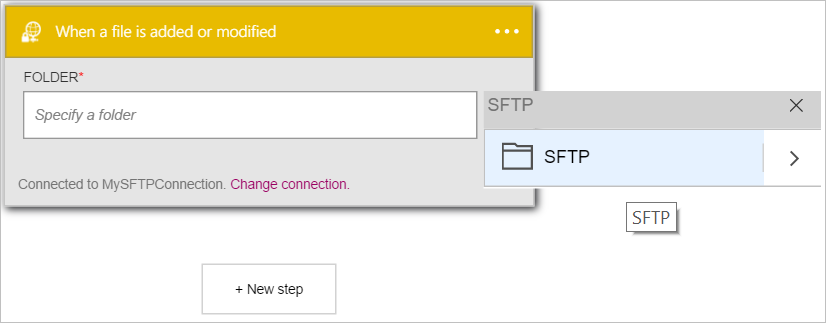
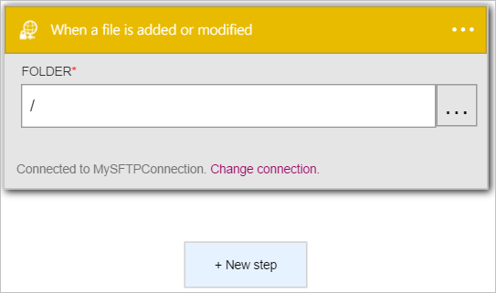

È possibile aggiungere una condizione di attivazione.

1. Immettere *sftp* nella casella di ricerca nella finestra di progettazione di applicazioni logica quindi selezionare il trigger **SFTP - quando viene aggiunto o modificato un file**   
  
- Apre il controllo **quando viene aggiunto o modificato un file**  
  
- Selezionare **…** disponibile sul lato destro del controllo. Verrà aperto il controllo di selezione cartella  
  
- Selezionare **SFTP** per selezionare la cartella radice della cartella per verificare la presenza di nuovi o modificati. Osservare che la cartella principale ora è visualizzata nel controllo **cartella** .  
   

A questo punto, l'app logica è stato configurato con un trigger che avrà inizio esecuzione di altro trigger e azioni del flusso di lavoro in un file viene modificato o creato nella cartella SFTP specifica. 

>[AZURE.NOTE]Per un'app di logica per il corretto funzionamento, deve contenere almeno un trigger e un'azione. Seguire la procedura descritta nella sezione per aggiungere un'azione.  