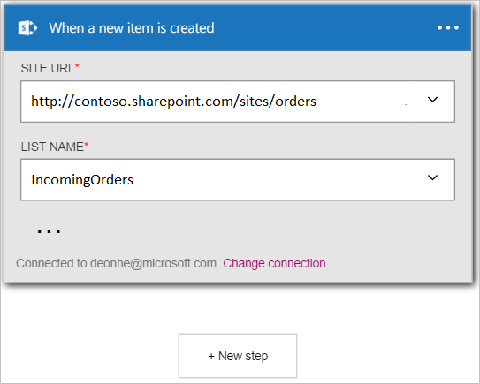

In questo esempio verrà illustrato come utilizzare **SharePoint Online - quando viene creato un nuovo elemento** trigger per avviare un flusso di lavoro app logica quando viene creato un nuovo elemento in un elenco di SharePoint Online.

>[AZURE.NOTE]Verrà chiesto di accedere all'account di SharePoint se non si è già creato una *connessione* a SharePoint Online.  

1. Immettere *sharepoint* nella casella di ricerca nella finestra di progettazione di applicazioni logica, quindi selezionare il trigger di **SharePoint Online - quando viene creato un nuovo elemento** .  
  
- Viene visualizzato il controllo **quando viene creato un nuovo elemento** .  
   
- Selezionare un **URL del sito**. Questo è il sito di SharePoint online che si desidera verificare la presenza di nuovi elementi avviare il flusso di lavoro.  
   
- Selezionare un **nome dell'elenco**. Si tratta dell'elenco nel sito di SharePoint Online che è possibile monitorare per i nuovi elementi che attiveranno il flusso di lavoro.  
   

A questo punto, l'app logica è stato configurato con un trigger che verrà avviata un'esecuzione di altro trigger e azioni del flusso di lavoro. Questa operazione verrà eseguita ogni volta che viene creato un nuovo elemento nell'elenco di SharePoint Online che è stata selezionata.  