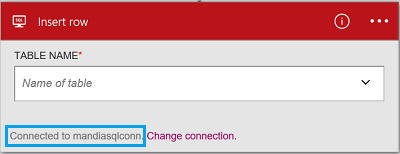

### Prerequisiti
- Un account Azure; è possibile creare un [account gratuito](https://azure.microsoft.com/free)
- Un [Database SQL Azure](../articles/sql-database/sql-database-get-started.md) con le informazioni di connessione, inclusi il nome del server, il nome del database e nome utente e password. Queste informazioni sono incluse nella stringa di connessione di Database SQL:
  
    Server = tcp:*yoursqlservername*. database.windows.net,1433;Initial catalogo =*yourqldbname*; Mantieni informazioni di protezione = False. ID utente = {your_username}; Password = {your_password}; MultipleActiveResultSets = False. Crittografare = vero; TrustServerCertificate = False. Timeout della connessione = 30;

    Altre informazioni sui [Database SQL Azure](https://azure.microsoft.com/services/sql-database).

> [AZURE.NOTE] Quando si crea un Database di SQL Azure, è anche possibile creare i database di esempio inclusi in SQL. 

Prima di utilizzare il Database di SQL Azure in un'app di logica, connettersi al Database di SQL. È possibile eseguire questa operazione facilmente all'interno dell'applicazione di logica nel portale di Azure.  

Connettersi al Database di SQL Azure con la procedura seguente:  

1. Creare un'app di logica. Nella finestra di progettazione logica App, aggiungere un trigger e quindi aggiungere un'azione. Selezionare **Mostra Microsoft API gestite** nell'elenco a discesa e quindi immettere "sql" nella casella di ricerca. Selezionare una delle operazioni:  

    

2. Se è stata creata in precedenza tutte le connessioni al Database SQL, verrà richiesto per i dettagli della connessione:  

     

3. Immettere i dettagli di Database SQL. Proprietà con un asterisco sono obbligatorie.

    | Proprietà | Dettagli |
|---|---|
| Connettersi tramite Gateway | Lasciare selezionata. Viene utilizzato quando ci si connette a un Server SQL locale. |
| Nome della connessione * | Immettere un nome per la connessione. | 
| Nome del Server SQL * | Immettere il nome del server; quale è simile al *servername.database.windows.net*. Il nome del server visualizzato nelle proprietà del Database di SQL nel portale di Azure è visualizzato anche nella stringa di connessione. | 
| Nome del Database SQL * | Immettere il nome assegnato il Database di SQL. Questo è incluso nell'elenco le proprietà del Database di SQL nella stringa di connessione: catalogo iniziale =*yoursqldbname*. | 
| Nome utente * | Immettere il nome utente che è stato creato quando è stato creato il Database di SQL. Questo è elencato nella proprietà del Database di SQL nel portale di Azure. | 
| Password * | Immettere la password creata quando è stato creato il Database di SQL. | 

    Queste credenziali vengono utilizzate per autorizzare l'app logica connettersi e accedere ai dati SQL. Una volta completato, dettagli relativi alla connessione simile al seguente:  

     

4. Selezionare **Crea**. 

5. Si noti che la connessione è stata creata. A questo punto, procedere con gli altri passaggi nell'app logica: 

    