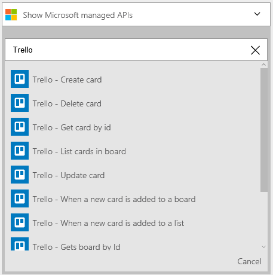
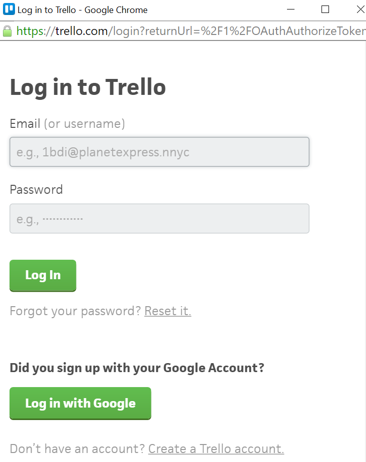

### Prerequisiti
- Un account [Trello](http://trello.com) 

Prima di poter usare l'account Trello in un'app di logica, è necessario autorizzare l'app logica per connettersi al proprio account Trello. Per tale operazione può essere facilmente all'interno dell'applicazione di logica nel portale di Azure. 

Ecco i passaggi per autorizzare l'app logica per connettersi al proprio account Trello:

1. Per creare una connessione a Trello, nella finestra di progettazione di app logica, selezionare **Mostra Microsoft API gestite** nell'elenco a discesa, quindi immettere *Trello* nella casella di ricerca. Selezionare il trigger o l'azione desiderata da usare:  
  
2. Se è stata creata tutte le connessioni a Trello prima, verrà viene richiesto di specificare le credenziali Trello. Queste credenziali verranno usate per autorizzare l'app logica a cui connettersi e accedere ai dati del proprio account Trello:  
   
3. Consente di connettersi a Trello:  
     
4. Specificare il nome utente Trello e la password per autorizzare l'app logica:  
    
5. Si noti la connessione è stata creata, l'ora gratuito procedere con gli altri passaggi nell'app logica:  
  
