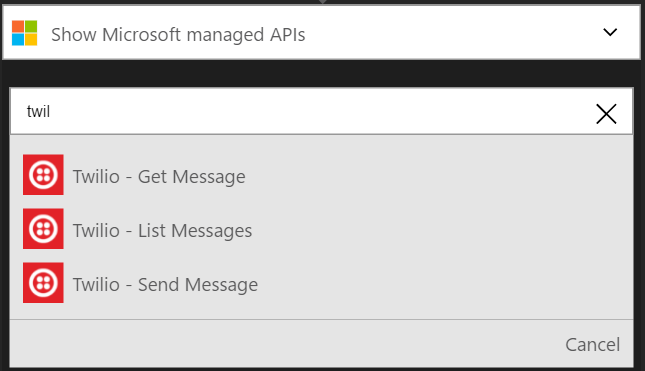

### Prerequisiti
- Un account Twilio
- Un numero di telefono Twilio verificato in grado di ricevere SMS
- Un numero di telefono Twilio verificato che può inviare SMS

>[AZURE.NOTE] Se si utilizza un account di prova Twilio, è possibile inviare SMS solo per i numeri di telefono **verificato** .  

Prima di poter usare l'account di Twilio in un'app di logica, è necessario autorizzare l'app logica per connettersi al proprio account Twilio. Per tale operazione può essere facilmente all'interno dell'applicazione di logica nel portale di Azure. 

Ecco i passaggi per autorizzare l'app logica per connettersi al proprio account Twilio:

1. Per creare una connessione a Twilio, nella finestra di progettazione di app logica, selezionare **Mostra Microsoft API gestite** nell'elenco a discesa, quindi immettere *Twilio* nella casella di ricerca. Selezionare il trigger o l'azione desiderata da usare:  
  
2. Se è stata creata tutte le connessioni a Twilio prima, verrà viene richiesto di specificare le credenziali Twilio. Queste credenziali verranno usate per autorizzare l'app logica a cui connettersi e accedere ai dati del proprio account Twilio:  
    
3. È necessario **l'id account Twilio** e **token di accesso Twilio** nel dashboard del Twilio, pertanto accedere al proprio account Twilio ora per acquisire questi due tipi di informazioni:  
    
4. App Twilio e logica utilizzare nomi diversi per identificare i due tipi di informazioni. Ecco come è necessario associare alla finestra di dialogo App logica:  
5. Selezionare il pulsante **Crea connessione** :  
  
6. Si noti la connessione è stata creata, l'ora gratuito procedere con gli altri passaggi nell'app logica:  
  