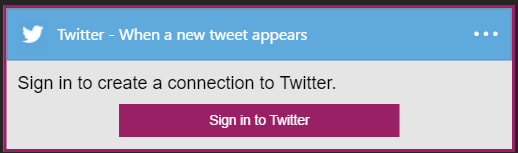

### Prerequisiti
- Un account Twitter 

Prima di poter usare l'account Twitter in un'app di logica, è necessario autorizzare l'app logica per connettersi al proprio account Twitter. Per tale operazione può essere facilmente all'interno dell'applicazione di logica nel portale di Azure. 

Ecco i passaggi per autorizzare l'app logica per connettersi al proprio account Twitter:

1. Per creare una connessione a Twitter, nella finestra di progettazione di app logica, selezionare **Mostra Microsoft API gestite** nell'elenco a discesa, quindi immettere *Twitter* nella casella di ricerca. Selezionare il trigger o l'azione desiderata da usare:  
  
2. Se è stata creata tutte le connessioni a Twitter prima, verrà viene richiesto di specificare le credenziali di Twitter. Queste credenziali verranno usate per autorizzare l'app logica a cui connettersi e accedere ai dati del proprio account Twitter:  
    
3. Specificare il nome utente Twitter e la password per autorizzare l'app logica:  
    
4. Verificare le autorizzazioni:  
    
6. Si noti la connessione è stata creata, l'ora gratuito procedere con gli altri passaggi nell'app logica:  
  