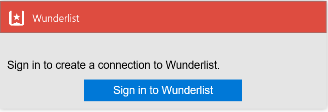

### Prerequisiti
- Un account Wunderlist  

Prima di poter usare l'account Wunderlist in un'app di logica, è necessario autorizzare l'app logica per connettersi al proprio account Wunderlist. Per tale operazione può essere facilmente all'interno dell'applicazione di logica nel portale di Azure. 

Ecco i passaggi per autorizzare l'app logica per connettersi al proprio account Wunderlist:

1. Per creare una connessione a Wunderlist, nella finestra di progettazione di app logica, selezionare **Mostra Microsoft API gestite** nell'elenco a discesa, quindi immettere *Wunderlist* nella casella di ricerca. Selezionare il trigger o l'azione desiderata da usare:  
  
2. Se è stata creata tutte le connessioni a Wunderlist prima, verrà viene richiesto di specificare le credenziali Wunderlist. Queste credenziali verranno usate per autorizzare l'app logica a cui connettersi e accedere ai dati del proprio account Wunderlist:   
    
2. Specificare le credenziali, quindi selezionare il pulsante per l'accesso  
    
3. Verrà indicato quali app logica dispone di autorizzazioni per procedere con l'account Wunderlist. Se l'utente acconsente, selezionare il pulsante per indicare il contratto. 
    
4. Infine, selezionare il pulsante di **autorizzazione**  
    

