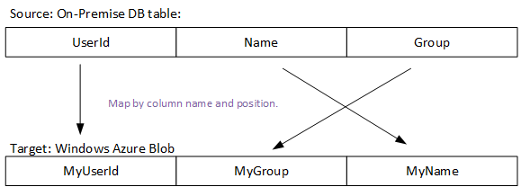

## Mapping di colonna con le regole di traduttore
Possibile utilizzare il mapping di colonna per specificare come colonne specificate nella "struttura" della mappa tabella di origine alle colonne specificata nella "struttura" della tabella sink. La proprietà **columnMapping** è disponibile nella sezione **typeProperties** dell'attività copia.

Mapping di colonna supportati gli scenari seguenti:

- Tutte le colonne nella tabella di origine "struttura" sono mappate a tutte le colonne della tabella sink "struttura".
- Un sottoinsieme di colonne nella tabella di origine "struttura" sono mappati a tutte le colonne della tabella sink "struttura".

Di seguito è le condizioni di errore e verrà generato un'eccezione:

- Un numero di colonne o più colonne nel "struttura" della tabella sink specificato nel mapping.
- Mapping duplicato.
- Risultato della query SQL non ha un nome di colonna specificato nel mapping.

## Esempi di mapping di colonna
> [AZURE.NOTE] Esempi riportati di seguito si applicano SQL Azure e Blob Azure ma si applicano a qualsiasi archivio di dati che supporta rettangolare set di dati. È necessario modificare set di dati e le definizioni di servizi collegati in esempi riportati di seguito in modo che puntino ai dati nell'origine dati rilevanti. 

### Esempio 1-colonna mappare da SQL Azure blob Azure
In questo esempio, la tabella di input ha una struttura e che punti a una tabella SQL in un database SQL Azure.

    {
        "name": "AzureSQLInput",
        "properties": {
            "structure": 
             [
               { "name": "userid"},
               { "name": "name"},
               { "name": "group"}
             ],
            "type": "AzureSqlTable",
            "linkedServiceName": "AzureSqlLinkedService",
            "typeProperties": {
                "tableName": "MyTable"
            },
            "availability": {
                "frequency": "Hour",
                "interval": 1
            },
            "external": true,
            "policy": {
                "externalData": {
                    "retryInterval": "00:01:00",
                    "retryTimeout": "00:10:00",
                    "maximumRetry": 3
                }
            }
        }
    }

In questo esempio, la tabella di output contiene una struttura e punti a un blob in un'archiviazione blob Azure.

    {
        "name": "AzureBlobOutput",
        "properties":
        {
             "structure": 
              [
                    { "name": "myuserid"},
                    { "name": "myname" },
                    { "name": "mygroup"}
              ],
            "type": "AzureBlob",
            "linkedServiceName": "StorageLinkedService",
            "typeProperties": {
                "folderPath": "mycontainer/myfolder",
                "fileName":"myfile.csv",
                "format":
                {
                    "type": "TextFormat",
                    "columnDelimiter": ","
                }
            },
            "availability":
            {
                "frequency": "Hour",
                "interval": 1
            }
        }
    }

Di seguito è riportata la JSON per l'attività. Colonne di origine associati alle colonne sink (**columnMappings**) utilizzando proprietà **traduttore** .

    {
        "name": "CopyActivity",
        "description": "description", 
        "type": "Copy",
        "inputs":  [ { "name": "AzureSQLInput"  } ],
        "outputs":  [ { "name": "AzureBlobOutput" } ],
        "typeProperties":    {
            "source":
            {
                "type": "SqlSource"
            },
            "sink":
            {
                "type": "BlobSink"
            },
            "translator": 
            {
                "type": "TabularTranslator",
                "ColumnMappings": "UserId: MyUserId, Group: MyGroup, Name: MyName"
            }
        },
       "scheduler": {
              "frequency": "Hour",
              "interval": 1
            }
    }

**Flusso di mapping di colonna:**

### Esempio 2: colonna mapping con query SQL di SQL Azure blob Azure
In questo esempio, una query SQL viene usata per estrarre dati da SQL Azure anziché semplicemente specificando il nome della tabella e i nomi delle colonne nella sezione "struttura". 

    {
        "name": "CopyActivity",
        "description": "description", 
        "type": "CopyActivity",
        "inputs":  [ { "name": " AzureSQLInput"  } ],
        "outputs":  [ { "name": " AzureBlobOutput" } ],
        "typeProperties":
        {
            "source":
            {
                "type": "SqlSource",
                "SqlReaderQuery": "$$Text.Format('SELECT * FROM MyTable WHERE StartDateTime = \\'{0:yyyyMMdd-HH}\\'', WindowStart)"
            },
            "sink":
            {
                "type": "BlobSink"
            },
            "Translator": 
            {
                "type": "TabularTranslator",
                "ColumnMappings": "UserId: MyUserId, Group: MyGroup,Name: MyName"
            }
        },
        "scheduler": {
              "frequency": "Hour",
              "interval": 1
            }
    }

In questo caso, i risultati della query prima di tutto sono mappati a colonne specificate nelle "struttura" di origine. Successivamente, le colonne di origine "struttura" sono mappate a colonne in sink "struttura" con regole specificate in columnMappings.  Si supponga che la query restituisca 5 colonne, altre due colonne quindi quelli specificati in "struttura" di origine.

**Flusso di mapping di colonna**

