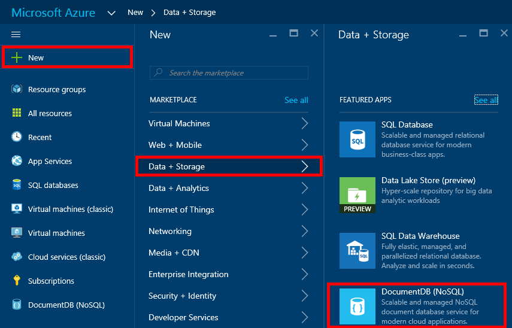

1.  Accedere al [portale di Azure](https://portal.azure.com/).
2.  In Jumpbar, fare clic su **Nuovo**, fare clic su **dati + spazio di archiviazione**e quindi fare clic su **DocumentDB (NoSQL)**.

      

3. Nella finestra e **nuovo account** , specificare la configurazione desiderata per l'account DocumentDB.

    

    - Nella casella **ID** immettere un nome per identificare il conto DocumentDB.  Quando l' **ID** viene convalidata, nella casella **ID** viene visualizzato un segno di spunta verde. Il valore di **ID** diventa il nome host all'interno di URI. L' **ID** può contenere solo lettere minuscole lettere, numeri e i '-' caratteri e deve essere compreso tra 3 e 50 caratteri. Si noti che *documents.azure.com* viene aggiunto al nome dell'endpoint che si sceglie, il cui risultato diventa l'endpoint di account DocumentDB.

    - Nella casella **NoSQL API** selezionare **DocumentDB**.  

    - Per l' **abbonamento**, selezionare l'abbonamento Azure che si desidera utilizzare per l'account DocumentDB. Se l'account ha un solo abbonamento, tale account sia selezionata per impostazione predefinita.

    - Nel **Gruppo di risorse**, selezionare o creare un gruppo di risorse per l'account DocumentDB.  Per impostazione predefinita, viene creato un nuovo gruppo di risorse. Per ulteriori informazioni, vedere [tramite il portale di Azure per gestire le risorse Azure](../articles/azure-portal/resource-group-portal.md).

    - Consente di specificare l'area geografica in cui pubblicare l'account DocumentDB **posizione** . 

4.  Dopo aver configurate le nuove opzioni account DocumentDB, fare clic su **Crea**. Per controllare lo stato della distribuzione, controllare l'hub di notifiche.  

      

    

5.  Dopo la creazione di account DocumentDB, è pronto per l'uso con le impostazioni predefinite. La coerenza predefinito dell'account DocumentDB viene impostata su **sessione**.  È possibile regolare la coerenza predefinito, fare clic su **Uniformità predefinita** nel menu della risorsa. Per ulteriori informazioni sui livelli di coerenza offerti dai DocumentDB, vedere [livelli di coerenza in DocumentDB](../articles/documentdb/documentdb-consistency-levels.md).

      

      

[How to: Create a DocumentDB account]: #Howto
[Next steps]: #NextSteps
[documentdb-manage]:../articles/documentdb/documentdb-manage.md
