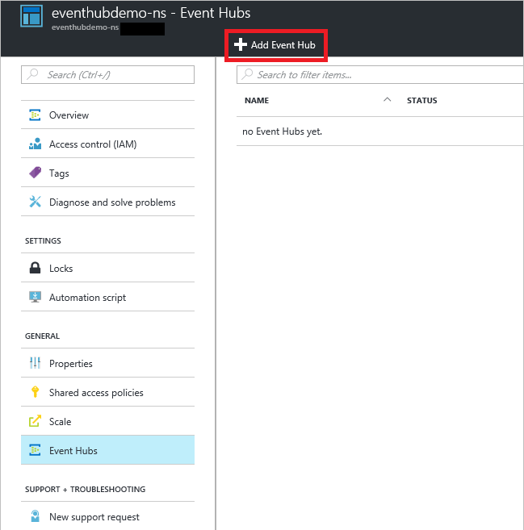
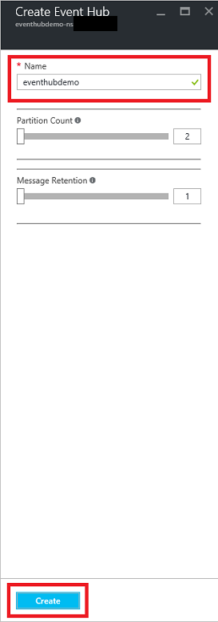

## Creare un Hub di evento

1. Accedere al [portale di Azure][]e fare clic su **Nuovo** nella parte superiore sinistra dello schermo.

2. Fare clic su **dati + Analitica**, quindi fare clic su **Evento hub**.

    

3. In e il **Crea dello spazio dei nomi** , immettere un nome dello spazio dei nomi. Il sistema immediatamente verifica se il nome è disponibile.

    

4. Dopo avere inserito accertarsi che il nome dello spazio dei nomi disponibili, scegliere il livello prezzo (Basic o Standard). Inoltre, scegliere un abbonamento Azure, gruppo di risorse e percorso in cui si desidera creare la risorsa. 

2. Fare clic su **Crea** per creare lo spazio dei nomi.

6. Nell'elenco evento hub dello spazio dei nomi, fare clic su spazio dei nomi appena creato.      

    

7. In e dello spazio dei nomi, fare clic su **Evento hub**.

    

8. Nella parte superiore e il, fare clic su **Aggiungi Hub evento**.

    

3. Digitare un nome per l'Hub di evento, quindi fare clic su **Crea**.

    

4. Nell'elenco dei hub di evento, selezionare il nome di evento Hub appena creato. 

    

5. Nuovo in e dello spazio dei nomi (non una e con Hub evento lo specifico), fare clic su **criteri di accesso Shared**e quindi fare clic su **RootManageSharedAccessKey**.

    

5. Fare clic sul pulsante Copia per copiare la stringa di connessione **RootManageSharedAccessKey** negli Appunti. Salvare la stringa di connessione da usare in un secondo momento nell'esercitazione.

    

L'Hub di evento è stato creato e disporre le stringhe di connessione che è necessario inviare e ricevere eventi.

[Portale di Azure]: https://portal.azure.com/