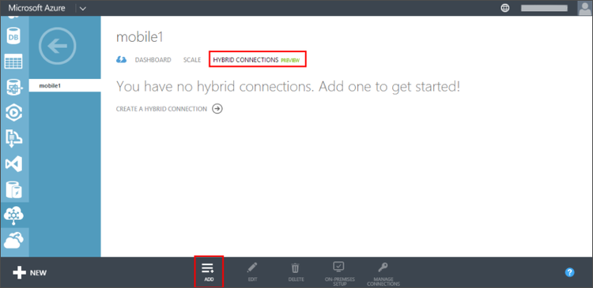

1. Nel computer locale, accedere al [Portale di gestione Azure](http://manager.windowsazure.com) (questo è il portale precedente).

2. Nella parte inferiore del riquadro di spostamento, selezionare **+ Nuovo** > **Servizi App** > **Servizio BizTalk** > **Creare personalizzata**.

3. Specificare un **Nome di servizio BizTalk** e selezionare un' **edizione**. 

    In questa esercitazione utilizza **mobile1**. È necessario specificare un nome univoco per il nuovo BizTalk Service.

4. Dopo aver creata BizTalk Service, selezionare la scheda **Connessioni ibrida** , quindi fare clic su **Aggiungi**.

    

    In questo modo si crea una nuova connessione ibrida.

5. Specificare un **nome** e **Il nome Host** per la connessione ibrida e impostare **porta** `1433`. 
  
    

    Nome host è il nome del server locale. Consente di configurare la connessione ibrido per accedere a SQL Server in esecuzione su porta 1433. Se si usa un'istanza di SQL Server denominata, utilizzare la porta statica definita in precedenza.

6. Dopo aver creato la nuova connessione, lo stato della della nuova connessione Mostra **locale installazione incompleta**.

7. Tornare al servizio per dispositivi mobili, fare clic su **Configura**, scorrere fino a **connessioni ibrido** fare clic su **Aggiungi ibrido connessione**, selezionare la connessione ibrido appena creato e fare clic su **OK**.

    In questo modo il servizio mobile utilizzare la nuova connessione ibrida.

Successivamente, è necessario installare ibrido Connection Manager nel computer locale.