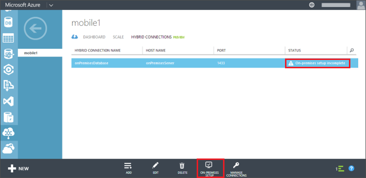

La gestione di connessione ibrido permette al computer locale a cui connettersi Azure e inoltro del traffico TCP. È necessario installare il responsabile di un computer locale in grado di connettersi per l'istanza di SQL Server.

1. La connessione che appena creata deve avere lo **stato** **su premesis installazione incompleta**. Fare clic su questa connessione e fare clic su **installazione locale**.

    

2. Fare clic su **installazione e configurazione**.

    Consente di installare un'istanza personalizzata di gestione connessione, che è già preconfigurato per funzionare con la connessione ibrido che appena creato.

3. Completare la procedura di configurazione per la gestione di connessione.

    Al termine dell'installazione, lo stato di connessione ibrido cambierà in **1 istanza connesso**. Potrebbe essere necessario aggiornare il browser e attendere alcuni minuti. 

Configurazione di connessione ibrida è stata completata.