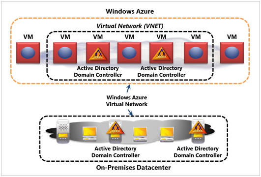
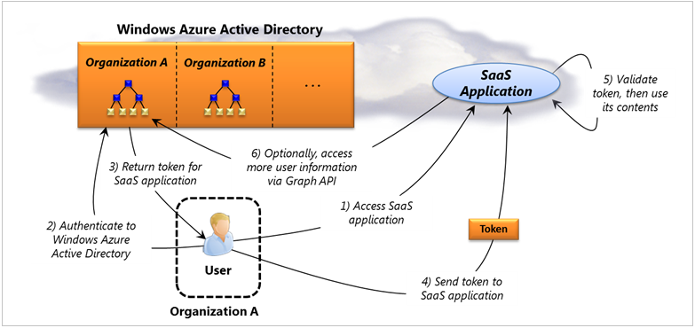
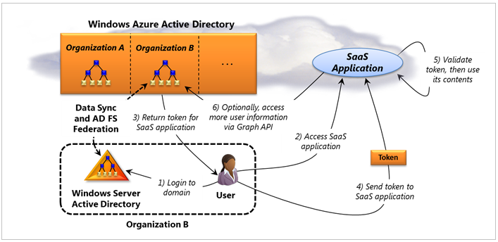
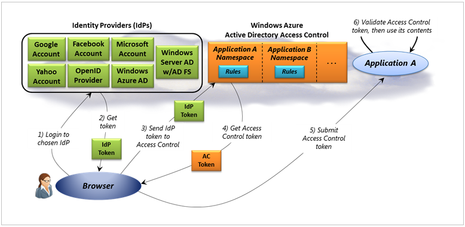

Gestione delle identità è importante nel cloud pubblico come in locale. A tale scopo, Azure supporta alcune tecnologie di identità area diversa. Sono le operazioni seguenti:

- È possibile eseguire Windows Server Active Directory (ossia solo Active Directory) nel cloud tramite macchine virtuali create con macchine virtuali di Azure. Questo approccio senso quando si usa Azure per estendere il data center locale nel cloud.

- È possibile utilizzare Azure Active Directory per assegnare agli utenti il single sign-on per le applicazioni [Software come un servizio](https://azure.microsoft.com/overview/what-is-saas/) . Ad esempio, Microsoft Office 365 utilizza la tecnologia e applicazioni in esecuzione su Azure o altre piattaforme cloud possono usarlo anche.

- Le applicazioni in esecuzione nel cloud o locale è possono usare il controllo di accesso Azure Active Directory consentono agli utenti nel Registro di utilizzo delle identità da Facebook, Google, Microsoft e altri provider di identità.

In questo articolo vengono illustrati tutti e tre di queste opzioni.

## Sommario

- [Esecuzione di Active Directory di Windows Server in macchine virtuali](#adinvm)

- [Utilizzo di Azure Active Directory](#ad)

- [Tramite il controllo di accesso di Azure Active Directory](#ac)

## Esecuzione di Active Directory di Windows Server in macchine virtuali

Che eseguono Windows Server Active Directory in macchine virtuali di Azure è molto simile esecuzione locale. [Figura 1](#fig1) Mostra un tipico esempio di questo aspetto.

Figura 1: Windows Server Active Directory è possibile eseguire in macchine virtuali Azure connessione al data center locale di un'organizzazione con Azure virtuali.

Nell'esempio illustrato di seguito, Windows Server Active Directory è in esecuzione in macchine virtuali create con macchine virtuali di Azure, tecnologia IaaS della piattaforma. Queste macchine virtuali e alcuni altri utenti possono essere raggruppati in una rete virtuale connessa a un data center locale utilizzando virtuali Azure. La rete virtuale carves su un gruppo di macchine virtuali cloud che interagiscono con la rete locale tramite una connessione di rete privata virtuale (VPN). Consente di eseguire queste macchine virtuali Azure simile a un altro subnet al data center locale. Come illustrato nella figura seguente, due di tali macchine virtuali in esecuzione controller di dominio Windows Server Active Directory. Altre macchine virtuali nella rete virtuale potrebbe essere in esecuzione applicazioni, ad esempio SharePoint o in uso in modo diverso, ad esempio per sviluppo e la verifica. La data center locale esegue anche due controller di dominio di Windows Server Active Directory.

Sono disponibili diverse opzioni per la connessione controller di dominio nel cloud con quelli in esecuzione in locale:

- Rendere una parte di un unico dominio di Active Directory.

- Creare separata Active Directory domini locale e nel cloud che fanno parte della stessa foresta.

- Creare insiemi di strutture di Active Directory separati nel cloud e in locale, quindi gli insiemi di strutture con trust tra insiemi di strutture o Windows Server Active Directory Federation Services (ADFS), che possono essere eseguiti anche in macchine virtuali in Azure.

Qualunque scelta venga eseguita, un amministratore deve assicurarsi che le richieste di autenticazione da utenti locali passare al cloud controller solo quando necessario, poiché il collegamento nel cloud è probabile che sia più reti locale lenta. Un altro fattore da valutare la possibilità di connessione cloud e controller di dominio locale è il traffico generato dalla replica. Controller di dominio nel cloud sono in genere nel proprio sito di Active Directory, che consente agli amministratori di pianificare la frequenza della replica è stata completata. Azure in base alle tariffe per il traffico inviato da un Data Center Azure, anche se non per byte inviata, che potrebbe influire su scelte replica dell'amministratore. È inoltre opportuno sottolineare che mentre Azure supportano il proprio sistema DNS (Domain Name), questo servizio manca caratteristiche richieste da Active Directory (ad esempio il supporto per i record DNS dinamico e SRV). Per questi motivi, che eseguono Windows Server Active Directory in Azure richiede la configurazione di server DNS nel cloud.

Che eseguono Windows Server Active Directory in macchine virtuali di Azure può essere utile nelle diverse situazioni. Ecco alcuni esempi:

- Se si sta utilizzando macchine virtuali di Azure come estensione del Data Center, è possibile eseguire applicazioni nel cloud che occorre controller di dominio locale per gestire operazioni, ad esempio le richieste di autenticazione di Windows o query LDAP. SharePoint, ad esempio interagisce spesso Active Directory e pertanto sebbene sia possibile eseguire una farm di SharePoint in Azure utilizzando una directory locale, impostazione controller nel cloud in modo significativo miglioreranno. (È importante tenere presente che non è richiesta, tuttavia; moltissime applicazioni possono essere eseguiti correttamente nel cloud usando solo controller di dominio locale.)

- Si supponga che una filiale lontani non dispone delle risorse per eseguire il proprio controller di dominio. Oggi, gli utenti devono eseguire l'autenticazione controller di dominio sul lato del mondo, gli account di accesso sono lenti. Esecuzione Active Directory in Azure in un Data Center Microsoft più vicino possibile accelerare questo senza più server nella filiale.

- Un'organizzazione che usa Azure di emergenza può gestire un piccolo gruppo di active macchine virtuali nel cloud, incluso un controller di dominio. È possibile prepararlo per espandere il sito in base alle esigenze per subentrare per gli errori in un' posizione.

Sono disponibili anche altre possibilità. Ad esempio, non si è necessario connettersi Windows Server Active Directory nel cloud a un data center locale. Se si desidera eseguire una farm di SharePoint che served un determinato gruppo di utenti, ad esempio, ognuno dei quali sarebbe accedere unicamente con identità basate su cloud, è possibile creare un insieme di strutture autonomo su Azure. Come si usa questa tecnologia dipende da cosa sono i propri obiettivi di. (Per informazioni più dettagliate sull'utilizzo Windows Server Active Directory con Azure, [vedere](http://msdn.microsoft.com/library/windowsazure/jj156090.aspx).)

## Utilizzo di Azure Active Directory

Come applicazioni SaaS diventano più comuni, generano una domanda: che tipo di servizio directory devono essere utilizzate queste applicazioni basate su cloud? Risposta Microsoft a tale domanda è Azure Active Directory.

Sono disponibili due opzioni principali per l'uso di questo servizio directory nel cloud:

- Utenti e organizzazioni che usano solo le applicazioni SaaS possono basarsi su Azure Active Directory come loro unico servizio directory.

- Le organizzazioni che eseguono Windows Server Active Directory possono connettersi nella directory locale a Azure Active Directory, quindi usarlo per conferire loro utenti il single sign-on per applicazioni SaaS.

[La figura 2](#fig2) illustra la prima di queste due opzioni, in cui è costituita da tutti sono necessarie Azure Active Directory.

Figura 2: Consente di Azure Active Directory agli utenti il dell'organizzazione single sign-on per applicazioni SaaS, tra cui Office 365.

Come illustrato nella figura seguente, Azure Active Directory è un servizio multi-tenant. Questo errore indica che contemporaneamente supportino diverse organizzazioni, la memorizzazione delle informazioni di directory sugli utenti ognuna di esse. In questo esempio, un utente all'organizzazione tenta di accedere a un'applicazione di SaaS. Questa applicazione potrebbe essere parte di Office 365, ad esempio SharePoint Online o può essere un altro elemento - le applicazioni non Microsoft inoltre possono utilizzare questa tecnologia. Poiché Azure Active Directory supporta il protocollo SAML 2.0, è sufficiente da un'applicazione è la possibilità di interagire con questo standard di settore. (Infatti, le applicazioni che utilizzano Azure Active Directory possono eseguire in qualsiasi Data Center, non solo un Data Center Azure).

Il processo inizia quando l'utente accede a un'applicazione di SaaS (passaggio 1). Per utilizzare questa applicazione, l'utente deve presentare un token rilasciato da Azure Active Directory.

Questo token contiene informazioni che identificano l'utente è firmato digitalmente da Azure Active Directory. Per ottenere il token, l'utente esegue l'autenticazione di Azure Active Directory mediante un nome utente e password (passaggio 2). Azure Active Directory quindi restituisce il token ha (passaggio 3).

Questo token viene quindi inviato all'applicazione SaaS (passaggio 4), che convalida firma del token e utilizza il relativo contenuto (passaggio 5). In genere, l'applicazione utilizzerà le informazioni sull'identità che il token contiene per decidere quali informazioni l'utente è autorizzato ad access e forse in altri modi.

Se l'applicazione richiede ulteriori informazioni sull'utente da quali contenuti nel token, è possibile richiedere direttamente da Azure Active Directory utilizzando l'API di Azure Active Directory grafico (passaggio 6). Nella versione iniziale di Azure Active Directory, lo schema di directory è molto semplice: contiene solo gli utenti e gruppi e le relazioni tra loro. Applicazioni è possono utilizzare queste informazioni per informazioni sulle connessioni tra gli utenti. Si supponga ad esempio che un'applicazione deve sapere chi è responsabile dell'utente per decidere se ha è autorizzato ad accedere a un blocco di dati. È possibile informazioni tramite una query di Azure Active Directory tramite l'API di grafico.

L'API grafico utilizza un protocollo REST normale, semplificando così il semplice da utilizzare dalla maggior parte dei client, inclusi i dispositivi mobili. L'API supporta anche le estensioni definite da OData, aggiunta di elementi, ad esempio un linguaggio di query per consentire a dati di access client in modo più utile. (Per altre informazioni su OData, vedere [Introduzione a OData](http://download.microsoft.com/download/E/5/A/E5A59052-EE48-4D64-897B-5F7C608165B8/IntroducingOData.pdf)). Poiché l'API grafico può essere utilizzato per informazioni sulle relazioni tra gli utenti, essa consente alle applicazioni di comprendere il social grafico incorporato nello schema di Azure Active Directory per una particolare organizzazione, ovvero il motivo per cui viene definito l'API di grafico. E per autenticarsi a Azure Active Directory per le richieste API del grafico, un'applicazione utilizza OAuth 2.0.

Se un'organizzazione non utilizza Windows Server Active Directory - non ha alcun server locali o domini - e si basa unicamente sul applicazioni cloud che utilizzano Azure Active Directory, utilizza solo questo directory cloud sarà agli utenti il dell'impresa single sign-on per tutti gli elementi. Ancora mentre si ottiene più comuni ogni giorno, la maggior parte delle organizzazioni ancora utilizzano locale domini creati con Windows Server Active Directory. Azure Active Directory svolge un ruolo utile per la riproduzione qui, come illustrato [nella figura 3](#fig3) .

figura 3: un'organizzazione possibile attuare una federazione di Windows Server Active Directory con Azure Active Directory per assegnare il relativo agli utenti il single sign-on per applicazioni SaaS.

In questo scenario, gli utenti dell'organizzazione B sarà possibile accedere a un'applicazione di SaaS. Prima di procedere, gli amministratori di directory dell'organizzazione devono stabilire una relazione federazione con Azure Active Directory tramite ADFS, come mostrato nella figura. Tali amministratori necessario configurare anche la sincronizzazione dei dati tra locale Windows Server dell'organizzazione Active Directory e Azure Active Directory. Viene automaticamente copiata informazioni sull'utente e gruppo dalla directory locale Azure Active Directory. Si noti in questo modo: In effetti, l'organizzazione estende la directory locale nel cloud. La combinazione di Windows Server Active Directory e Azure Active Directory in questo modo l'organizzazione fornisce un servizio directory che può essere gestito come una singola entità, mantenendo una ridotta entrambi locale e nel cloud.

Per utilizzare Azure Active Directory, l'utente prima di tutto accede al proprio dominio di Active Directory locale come di consueto (passaggio 1). Quando si tenta di accedere all'applicazione SaaS (passaggio 2), la federazione comporta Azure Active Directory emissione Lei un token dell'applicazione (passaggio 3). (Per altre informazioni su come funziona la federazione, vedere [identità basata sulle attestazioni per Windows: tecnologie e scenari](http://www.davidchappell.com/writing/white_papers/Claims-Based_Identity_for_Windows_v3.0--Chappell.docx).) Come prima, questo token contiene informazioni che identificano l'utente è firmato digitalmente da Azure Active Directory. Questo token viene quindi inviato all'applicazione SaaS (passaggio 4), che convalida firma del token e utilizza il relativo contenuto (passaggio 5). E nello scenario precedente SaaS applicazione può utilizzare l'API di grafico per acquisire familiarità con l'utente se necessario (passaggio 6).

Oggi, Azure Active Directory non sostituzione completa locale Windows Server Active Directory. Come già detto, la directory cloud ha uno schema di più semplice e non sono presenti elementi, ad esempio i criteri di gruppo, la possibilità di memorizzare le informazioni su computer e al supporto per LDAP. (Infatti, un computer Windows non può essere configurato per consentire agli utenti di accedere a questa mediante unicamente Azure Active Directory, si tratta di uno scenario supportato.) Se, tuttavia, gli obiettivi iniziali di Azure Active Directory includono consentendo alle applicazioni di accesso agli utenti di enterprise nel cloud senza mantenere un account di accesso separato e liberare locale gli amministratori di directory manualmente la sincronizzazione nella directory locale con tutte le applicazioni SaaS che l'organizzazione utilizza. Nel tempo, tuttavia, si aspettano del servizio directory cloud una vasta gamma di scenari di indirizzi.

## Tramite il controllo di accesso di Azure Active Directory

Per risolvere numerosi problemi, è possono utilizzare tecnologie di identità basato sul cloud. Azure Active Directory può concedere ad agli utenti il un'organizzazione single sign-on per più applicazioni SaaS, ad esempio. Ma tecnologie di identità nel cloud possono anche essere utilizzate in altri modi.

Si supponga, ad esempio, un'applicazione desidera consentire agli utenti l'accesso utilizzando i token emessi più *provider di identità (IdPs)*. Molti provider di identità diversi esistono oggi, inclusi Facebook, Google, Microsoft e altri, e le applicazioni di frequente consentono agli utenti ad accedere con una di queste identità. Perché un'applicazione deve preoccuparsi per mantenere il proprio elenco di utenti e password quando invece si basa su identità già esistenti? Accettare le identità esistenti semplifica agli utenti che hanno uno meno nome utente e password da ricordare e per gli utenti che creano l'applicazione, che non è più necessario mantenere il proprio elenco di nomi utente e password.

Ma mentre ogni provider di identità viene generato un tipo di token, tali token non standard: ogni IdP con il proprio formato. Inoltre, le informazioni contenute in tali token non sono inoltre standard. Affinché accetti i token emessi, ad esempio, Facebook, Google e Microsoft un'applicazione è affrontare di scrittura di codice univoco per gestire ognuno dei diversi formati.

Ma il motivo per cui eseguire questa operazione? Perché non invece creare intermediario in grado di generare un unico formato token con una rappresentazione comune delle informazioni di identità? Questo approccio consentirebbe di vita più semplice per gli sviluppatori che creano applicazioni, dal momento che ora devono gestire un solo tipo di token. Azure il controllo dell'accesso Active Directory responsabile esattamente, fornire un intermediario nel cloud per l'utilizzo di token diversi. [La figura 4](#fig4) Mostra come funziona

figura 4: controllo di accesso di Azure Active Directory risulta più facile per le applicazioni accettare i token di identità emessi da diversi provider.

Il processo inizia quando si tenta di accedere all'applicazione da un browser. L'applicazione rimanda a un IdP non autorizzato (e che l'applicazione anche trust). Utente viene autenticato se stesso in IdP, ad esempio immettendo un nome utente e password (passaggio 1) e il IdP restituisce un token contenente informazioni sul proprio (passaggio 2).

Come illustrato nella figura seguente, il controllo dell'accesso supporta un intervallo di diversi IdPs basato sul cloud, inclusi account creato da Google, Yahoo, Facebook, Microsoft (precedentemente noto come Windows Live ID) e un provider di OpenID. Supporta anche identità create con Azure Active Directory e, tramite la federazione con ADFS, Windows Server Active Directory. L'obiettivo è per coprire l'identità di uso più frequente oggi, se si sta emesso da IdPs nel cloud o locale.

Una volta che il browser dell'utente ha un token IdP dal proprio scelto IdP, dell'invio di tale token per il controllo di accesso (passaggio 3). Controllo dell'accesso convalidato il token, assicurandosi che viene effettivamente emesso da questo IdP, quindi crea un nuovo token in base alle regole definite per questa applicazione. Ad esempio Azure Active Directory, il controllo dell'accesso è un servizio multi-tenant, ma il tenant sono applicazioni anziché organizzazioni cliente. Ogni applicazione accessibile spazio dei nomi, come mostrato nella figura e definisce diverse regole sull'autorizzazione e così via.

Queste regole consentono amministratore ogni applicazione di definire come token da vari IdPs deve essere trasformato in un token di controllo di accesso. Ad esempio, se IdPs diversi utilizzano tipi diversi per rappresentare i nomi utente, le regole di controllo dell'accesso trasformare tutte in un tipo di nome utente comuni. Controllo dell'accesso invia quindi il nuovo token al browser (passaggio 4), che invia all'applicazione (passaggio 5). Una volta è stato modificato il token di controllo di accesso, l'applicazione verifica che questo token realmente emesso dal controllo di accesso, quindi utilizza le informazioni in essa contenute (passaggio 6).

Anche se questo processo può sembrare complicato, effettivamente semplifica in modo significativo per la creazione dell'applicazione. Invece di gestire diversi token che contiene informazioni diverse, l'applicazione può accettare identità rilasciata da più provider di identità mentre si continua a essere visualizzato un singolo token con informazioni comuni. Inoltre, piuttosto che richiede di essere configurato per la protezione IdPs vari ogni applicazione, queste relazioni di trust invece vengono gestite dal controllo di accesso: un'applicazione solo necessario attendibile.

È opportuno sottolineare che nulla sul controllo di accesso è collegata a Windows, potrebbe essere utilizzata anche da un'applicazione di Linux accettati solo identità Google e Facebook. E anche se il controllo dell'accesso fa parte della famiglia di Azure Active Directory, è possibile pensare che ne come servizio tutto distinto da quanto è stato descritto nella sezione precedente. Mentre entrambe le tecnologie lavora con identità, rispondono risolvono problemi diversi (anche se Microsoft ha detto previsto integrare i due un certo punto).

Utilizzo di identità è importante in quasi tutte le applicazioni. L'obiettivo di controllo di accesso è per rendere più semplice per gli sviluppatori di creare applicazioni che accettano identità dal provider di identità diversi. Inserendo questo servizio nel cloud, Microsoft ha reso disponibile in qualsiasi applicazione in qualsiasi piattaforma.

##Informazioni sull'autore

David Chappell è dell'entità di Chappell & Associates [www.davidchappell.com](http://www.davidchappell.com) San Francisco, California.
