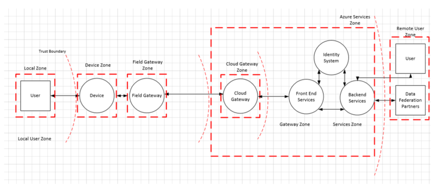
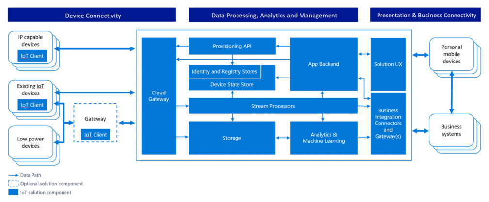

# Architettura di sicurezza di Internet di elementi

Quando si progetta un sistema, è importante comprendere le potenziali minacce per tale sistema e aggiungere difesa appropriata, come il sistema è progettato e architettura. È particolarmente importante progettare il prodotto dall'inizio con l'obiettivo della sicurezza perché understanding come un utente malintenzionato potrebbe essere in grado di danneggiare sistemi consente di eseguire azioni preventive a verificare appropriati sono presenti dall'inizio. 

## Protezione inizia con un modello di rischio
 
Microsoft ha tempo utilizzato modelli di rischio per i propri prodotti e ha reso modellazione dell'azienda processo disponibile pubblicamente. Viene illustrato l'esperienza di società che la modellazione disponga imprevisti vantaggi oltre la conoscenza immediata dei quali le minacce sono più in materia. Ad esempio, crea anche un avenue alla discussione con altri utenti all'esterno di team di sviluppo, che possono causare nuove idee e miglioramenti del prodotto.
  
L'obiettivo della modellazione è di comprendere come autore di un attacco potrebbe essere in grado di danneggiare e quindi verificare che siano appropriati azioni preventive di. Forza la modellazione rischio la progettazione del team da prendere in considerazione azioni preventive come il sistema è progettato anziché dopo un sistema viene distribuito. Questo fatto è fondamentale importanza, poiché è impossibile, adattamento di difesa per numerose dei dispositivi nel campo soggetta a errori e verrà lasciare i clienti a rischio.

Molti team di sviluppo è un processo eccellente ai requisiti funzionali per il sistema che traggono vantaggio ai clienti di acquisizione. Tuttavia, che identifica modi non evidente che un utente potrebbe essere utilizzate in modo improprio il sistema è più complessa. La modellazione consentono ai team di sviluppo comprendere cosa può fare un utente malintenzionato e sui motivi per cui. La modellazione è un processo strutturato che consente di creare un'analisi approfondita della sicurezza le scelte di progettazione del sistema, nonché di modifica per la progettazione apportate lungo la modalità di protezione tale impatto. Quando un modello di rischio è semplicemente un documento, in questa documentazione rappresenta anche una soluzione ideale per garantire la continuità delle conoscenze, conservazione di esperienze maturate e nuova Guida del team inizio rapidamente. Infine, a seguito della modellazione consiste nel consentono di valutare altri aspetti della protezione, ad esempio quali gli impegni di sicurezza che si desidera fornire ai clienti. Tali impegni in combinazione con la modellazione verranno informare e guidare il test della soluzione Internet di elementi (IoT).
 

### Quando modellazione

[La modellazione del](http://www.microsoft.com/security/sdl/adopt/threatmodeling.aspx) mette a disposizione il valore massimo è incorporata in fase di progettazione. Quando si progetta, è possibile la massima flessibilità per apportare modifiche per eliminare le minacce. Eliminazione delle minacce per impostazione predefinita è il risultato desiderato. Risulta molto più semplice rispetto all'aggiunta azioni preventive, tali test e verifica rimangano corrente e inoltre, ad esempio eliminazione non è sempre possibile. Quest'ultimo diventa più difficile da eliminare le minacce come un prodotto diventa più consolidato e a sua volta in ultima analisi richiederà quantità di lavoro e degli svantaggi molto più difficili di modellazione sin dall'inizio nello sviluppo.

### Gli elementi da modello di rischio

È consigliabile thread modello la soluzione nel suo complesso e anche lo stato attivo nelle aree seguenti:

- Le funzionalità di protezione e privacy
- Le funzionalità di cui gli errori sono pertinenti alla sicurezza
- Le funzionalità che interessano un limite di trust 

### Chi delle minacce modelli

La modellazione è un processo come qualsiasi altro.  È opportuno considerare il documento modello threat come qualsiasi altro componente della soluzione e convalidarlo. Molti team di sviluppo è un processo eccellente ai requisiti funzionali per il sistema che traggono vantaggio ai clienti di acquisizione. Tuttavia, che identifica modi non evidente che un utente potrebbe essere utilizzate in modo improprio il sistema è più complessa. La modellazione consentono ai team di sviluppo comprendere cosa può fare un utente malintenzionato e sui motivi per cui.

### Come modello di rischio

Il processo di modellazione è costituito da quattro passaggi. i passaggi sono:

- L'applicazione del modello
- Consente di enumerare le minacce
- Ridurre le minacce
- Convalidare le azioni preventive

#### I passaggi del processo

Tre regole da tenere presenti durante la creazione di un modello di rischio:

1. Creare un diagramma fuori l'architettura di riferimento. 
2. Avviare ampiezza funzionalità. Viene fornita una panoramica e acquisire familiarità con il sistema in generale, prima di entrare merito approfondita.  In questo modo si garantisce che si approfondito nelle posizioni appropriate.
3. Il processo di unità, non lasciare il processo è di unità. Se si riscontra un problema nella fase di modellazione e prendere in considerazione lo, consultare!  Non si sentono è necessario eseguire la procedura seguente slavishly.  

#### Minacce

Gli elementi di quattro core di un modello di rischio sono:

- Processi (servizi web, servizi Win32, * nix daemon e così via. Si noti che è possibile eliminare alcune entità complessi (ad esempio gateway di campo e sensori) come un processo quando tecnico drill-down nelle seguenti aree non è possibile.
- Archivi dati (via Internet sono memorizzati i dati, ad esempio un file di configurazione o database)
- Flusso di dati (dove vengono spostati i dati tra gli altri elementi nell'applicazione)
- Le entità esterne (lasciare che interagisce con il sistema, ma non è incluso nel controllo dell'applicazione, ad esempio gli utenti e satellitari feed)

Tutti gli elementi nel diagramma dell'architettura sono soggetti a diversi pericoli. verrà utilizzato il tasto di scelta rapida STRIDE. Leggere [Rischio modellazione nuovamente, STRIDE](https://blogs.msdn.microsoft.com/larryosterman/2007/09/04/threat-modeling-again-stride/) per ulteriori informazioni sugli elementi STRIDE.

Elementi diversi del diagramma applicazioni sono soggetti a determinati minacce STRIDE:

- I processi sono soggetti a STRIDE
- I flussi di dati sono soggetti a TID
- Archivi dati sono soggetti a TID e, in alcuni casi, R, se gli archivi dati sono i file di registro.
- Le entità esterne sono soggetti a SRD

## Sicurezza in IoT

I dispositivi collegati speciali hanno un numero significativo di potenziali aree della superficie di interazione e modelli di interazione, ognuno dei quali da prendere in considerazione per fornire una struttura di base per la protezione digitale accesso a tali dispositivi. Il termine "digital access" viene utilizzato di seguito consentono di distinguerli dalle operazioni che vengono eseguite tramite l'interazione diretta dispositivo in cui viene fornita protezione dell'accesso tramite il controllo dell'accesso fisico. Ad esempio, inserire il dispositivo in una stanza con un blocco sulla porta. Mentre non è negato l'accesso fisico tramite software e hardware, può essere misure per impedire l'accesso fisico iniziale di interferenza di sistema. 

Esplorare i modelli di interazione, verranno esaminati "controllo dispositivo" e "dati dispositivo" con lo stesso livello di attenzione. "Controllo dispositivo" può essere classificato come qualsiasi informazione fornita a un dispositivo da qualsiasi parte con l'obiettivo di modifica o che influenzano il comportamento per raggiungere il suo stato o lo stato del proprio ambiente. "Dati dispositivi" possono essere classificati come qualsiasi informazione che genera un dispositivo a qualsiasi altra parte sullo stato e lo stato osservato del proprio ambiente.
   
Per ottimizzare le procedure consigliate, è consigliabile che una tipica architettura IoT essere suddiviso nei diversi componenti/aree come parte del modello esercizio di rischio. Queste aree vengono descritti dettagliatamente nella presente sezione e includono:

-   Dispositivo
-   Campo Gateway,
-   Cloud gateway, e
-   Servizi.

Aree sono ampie verso segmento di una soluzione. ogni area è spesso requisiti propri dati e l'autenticazione e autorizzazione. Aree possono inoltre essere utilizzato per danni di isolamento e limitare l'impatto delle aree di attendibilità bassa in più aree di protezione.

Ogni area è separata da un limite di attendibilità, cui viene indicato come linea di colore rossa punteggiata nella figura riportata di seguito. Rappresenta una transizione di dati/informazioni da un'origine a un altro. Durante questo periodo, dati/informazioni potrebbe essere soggetto a Spoofing, manomissione, ripudio, divulgazione di informazioni, Denial of Service e l'elevazione dei privilegi (STRIDE).

 

I componenti riportati all'interno di ogni limite inoltre sono soggetti ai STRIDE abilitazione completa di 360 visualizzazione della soluzione di modellazione. Nelle sezioni seguenti elaborano in ognuno dei componenti e problemi di protezione specifici e soluzioni che devono essere collocate nella posizione corretta.

Le sezioni di seguito verranno illustrati i componenti standard in genere disponibili in queste aree.

### L'area dispositivo

L'ambiente di dispositivo è lo spazio fisico immediato attorno il dispositivo fisico in cui l'accesso e/o "rete locale" accesso digitale peer-to-peer per il dispositivo è realizzabile. Una rete"locale" viene considerato uguale a una rete distinti e isolati compreso tra – ma potenzialmente portati a – Internet pubblico, che include qualsiasi altra tecnologia breve raggio radio wireless che consente la comunicazione peer-to-peer di dispositivi. Per farlo viene *non* include alcuna tecnologia di virtualizzazione network creare l'illusione della rete locale e inoltre non include le reti pubbliche operatore che richiedono le due dispositivi per comunicare attraverso lo spazio di rete pubblica se fossero immettere una relazione di comunicazione peer-to-peer.

### L'area di Gateway di campo

Campo gateway è un dispositivo/appliance e alcuni server generico di software che funziona come attivatore comunicazione ed eventualmente come un sistema di controllo del dispositivo e l'hub di elaborazione dati dispositivo. L'area di gateway campo include il gateway campo attributo e tutti i dispositivi che non vengono è associati. Come suggerito dal nome, campo gateway agire strutture di elaborazione dei dati esterni dedicato, sono in genere percorso associato, sono potenzialmente soggetti a intrusioni fisiche e potranno limitato ridondanza operativa. Tutto per affermare che un gateway di campo è in genere un sistema una possibile toccare e il sabotaggio durante la conoscenza che cos'è la funzione. 

Un gateway di campo è diverso da un router il mere traffico che si è verificato un ruolo attivo nella gestione dell'accesso e ciò indica che è un'applicazione per il flusso di informazioni indirizzato sessione terminal o connessione di rete ed entità. Un dispositivo NAT o firewall, al contrario, non possono essere come gateway campo poiché non sono connessione esplicita o terminali sessione, ma anziché un connessioni route (o bloccati) o effettuate attraverso tali sessioni. Il gateway campo dispone di due aree superficie di attacco distinte. Uno deve affrontare i dispositivi che devono essere collegati ad esso e rappresenta il bordo interno dell'area e l'altra con tutti i partecipanti esterni ed è il bordo dell'area.   

### L'area di gateway cloud

Gateway cloud è un sistema che consente la comunicazione remota da e a dispositivi o gateway di campo da diversi siti all'interno di spazio di rete pubblica, in genere nei confronti di un controllo basato su cloud e un sistema di analisi dei dati, una federazione di tali sistemi. In alcuni casi, un gateway cloud può immediatamente facilitano l'accesso ai dispositivi per scopi di terminali, ad esempio cellulari o Tablet. Nel contesto illustrato di seguito, "cloud" si intende per fare riferimento a un sistema di elaborazione dati dedicato che non è associato allo stesso sito come dispositivi collegati o gateway di campo. Anche in un'area Cloud, misurazioni operative impediscono l'accesso fisico assegnato e non deve necessariamente reso disponibile a un'infrastruttura "cloud pubblico".  

Un gateway cloud può essere mappato potenzialmente in una sovrapposizione della virtualizzazione di rete per isolare il gateway cloud e in tutti i relativi dispositivi collegati e gateway di campo da qualsiasi altro traffico di rete. Il gateway cloud stesso è un sistema di controllo del dispositivo né un'elaborazione né unità di archiviazione per i dati dei dispositivi; tali funzionalità interfaccia con il gateway cloud. L'area di gateway cloud include il gateway cloud con tutti i gateway di campo e i dispositivi direttamente o indirettamente assegnati. Il bordo dell'area è una distinti della superficie di attacco in tutte le parti esterne comunicano tramite.

### L'area di servizi

"Servizio" viene definito per il contesto di qualsiasi componente software o il modulo che è l'interazione con i dispositivi tramite un gateway campo - o cloud per la raccolta dei dati e analisi e di comando e controllo.  I servizi sono mediazione. Agire sotto la propria identità per raggiungere i gateway e altri sottosistemi, memorizzare e analisi dei dati, in modo autonomo inviare comandi a dispositivi in base a pianificazioni o sui concetti di dati ed espongono le informazioni e il controllo funzionalità per gli utenti finali autorizzati.

### Dispositivi per le informazioni e i dispositivi speciali

PC, telefoni e Tablet sono principalmente informazioni interattiva dispositivi. Telefoni e Tablet in modo esplicito ottimizzato ottimizzazione della durata della batteria. È preferibile disattivare parzialmente quando non immediatamente interagire con una persona o quando non offrono servizi come la riproduzione di musica o instradamento proprietari per una determinata località. Dal punto di vista sistemi ai dispositivi technology queste informazioni sono prevalentemente funge da proxy per raggiungere le persone. Sono "attuatori di persone" suggerimento azioni e "persone sensori" raccolta di input. 

Dispositivi per uno scopo specifico, da sensori temperatura semplici che complesse factory le righe di produzione con migliaia di componenti interni, sono diversi. Questi dispositivi sono molto più nell'ambito dello scopo e anche se forniscono un tipo di interfaccia utente, che in gran parte sono limitate a interfacciare o essere integrate in risorse reali. Vengono misurare e segnalare circostanze ambientali, attivare valvole, controllare servos, suono allarmi, passare illuminazione ed eseguire molte altre attività. Contribuiscono a possono essere utilizzati per il quale un dispositivo di informazioni è troppo generico, troppo costosa, troppo grande o troppo fragile. Lo scopo concreto stabilisce immediatamente le tecniche di progettazione come anche il valuta il budget disponibile per i produzione e il corretto funzionamento di durata programmata. La combinazione di questi due fattori chiave vincola disponibili compute budget energia, footprint fisica e pertanto disponibili di archiviazione, operativi e funzionalità di protezione.  

Se un elemento "quale l'attivazione di un problema" con dispositivi controllare automatizzati o remoti, ad esempio difetti fisici o logica di controllo difetti per la modifica e willful accesso non autorizzato. Una quantità elevata di produzione è possibile che venga eliminata, edifici può anche essere looted o un incendio e utenti possono essere danneggiata o addirittura della matrice. Si tratta, naturalmente, una classe di danneggiamento rispetto a un utente limitarsi solamente limite del rubato carta di credito tutto diversa. La barra di protezione per i dispositivi che effettuare operazioni di spostamento e per i dati sensore risultante nei comandi che causano aspetti da spostare, deve essere maggiore di in qualsiasi e-commerce o scenario bancario. 

### Le interazioni tra dati dispositivo e il controllo del dispositivo

I dispositivi collegati speciali hanno un numero significativo di potenziali aree della superficie di interazione e modelli di interazione, ognuno dei quali da prendere in considerazione per fornire una struttura di base per la protezione digitale accesso a tali dispositivi. Il termine "digital access" viene utilizzato di seguito consentono di distinguerli dalle operazioni che vengono eseguite tramite l'interazione diretta dispositivo in cui viene fornita protezione dell'accesso tramite il controllo dell'accesso fisico. Ad esempio, inserire il dispositivo in una stanza con un blocco sulla porta. Mentre non è negato l'accesso fisico tramite software e hardware, può essere misure per impedire l'accesso fisico iniziale di interferenza di sistema. 
 
Esplorare i modelli di interazione, verranno esaminati "controllo dispositivo" e "dati dispositivo" con lo stesso livello di attenzione durante la modellazione. "Controllo dispositivo" può essere classificato come qualsiasi informazione fornita a un dispositivo da qualsiasi parte con l'obiettivo di modifica o che influenzano il comportamento per raggiungere il suo stato o lo stato del proprio ambiente. "Dati dispositivi" possono essere classificati come qualsiasi informazione che genera un dispositivo a qualsiasi altra parte sullo stato e lo stato osservato del proprio ambiente. 

## Modellazione dell'architettura di riferimento IoT Azure

Microsoft utilizza il framework descritto in precedenza per delle minacce modellazione per Azure IoT. Nella sezione seguente pertanto è necessario utilizzare l'esempio concreto Azure IoT dell'architettura di riferimento per illustrare come pensa rischio modellazione per IoT e come affrontare le minacce identificate. In questo caso è identificato quattro principali aree dello stato attivo:

-   Le origini dati e dispositivi
-   Trasferimento di dati
-   Dispositivo e l'elaborazione di eventi e
-   Presentazione

 

Nel diagramma seguente offre una visione semplificata della IoT architettura Microsoft utilizzando un modello di diagramma di flusso di dati utilizzato da Microsoft Threat modellazione Tool:

È importante tenere presente che l'architettura separa le funzionalità di dispositivo e il gateway. Ciò consente all'utente di utilizzare dispositivi gateway sono più sicuri: sono in grado di comunicare con il gateway cloud mediante protocolli sicuri, che in genere richiede maggiore carico di elaborazione di un dispositivo nativo -, ad esempio un termostato - grado di offrire in modo autonomo. Nell'area Servizi di Azure, si presuppone che il Gateway Cloud è rappresentato dal servizio Azure IoT Hub.

### Trasporto/dati di origini dati e dispositivi

In questa sezione illustra l'architettura descritta in precedenza attraverso l'obiettivo della modellazione e viene fornita una panoramica di come si ha deciso di risolvere alcuni problemi intrinseci di. È dedicata gli elementi di base di un modello di rischio:

- Processi (quelli sotto il controllo e gli elementi esterni)
- Comunicazione (denominata anche flussi di dati)
- Archiviazione (denominato anche archivi dati)

#### Processi

In ognuna delle categorie descritte nell'architettura di Azure IoT, si tenta di ridurre un numero di rischi diversi tra le diverse fasi dati/informazioni esiste nel: processo, comunicazioni e archiviazione. Di seguito viene fornita una panoramica delle più comuni per la categoria "processo", seguito da una panoramica di come queste potrebbe essere ridotti migliore: 

**Lo spoofing (S)**: un autore dell'attacco può estrarre materiale della chiave di crittografico da un dispositivo, vale a dire a livello hardware o software e successivamente access il sistema con un altro dispositivo fisico o virtuale con l'identità del dispositivo materiale della chiave è stato escluso dalla. Un'illustrazione buona è controlli remoti che possono convertire qualsiasi TV e che sono strumenti burlone più comuni.

**Denial of Service (D)**: un dispositivo può essere eseguito il rendering in grado di funzionare o la comunicazione tramite interferire con radiofrequenze o fili legati. Ad esempio una videocamera controllo con la connessione di rete o power intenzionalmente foratura non segnalerà dati, affatto.

**Manomissioni (M)**: un autore dell'attacco potrebbe parzialmente o interamente sostituire il software in esecuzione nel dispositivo per consentire il software sostituito sfruttare l'autenticità dell'identità del dispositivo, se disponibile per il programma illecito chiavi o strutture crittografiche premuto materiale per la chiave. Ad esempio, un autore dell'attacco può sfruttare le estratto materiale della chiave per intercettare e non visualizzare i dati dal dispositivo nel percorso di comunicazione e lo sostituisce con dati falsi autenticata con il furto materiale della chiave.

**Divulgazione di informazioni (I)**: se il dispositivo esegue software modificato, tale software modificato può causare una perdita dei dati per le parti non autorizzate. Ad esempio, un attacco può sfruttare le chiavi estratti per inserire direttamente nel percorso di comunicazione tra il dispositivo e un gateway controller o un campo o al gateway cloud per utilizzare off informazioni.

**Elevazione di privilegi (E)**: è possibile forzare un dispositivo che esegue funzioni specifiche per eseguire un'altra operazione. Ad esempio, una valvola è programmata per aprire per metà può essere indotto per aprire completamente.

| **Componente** | **Rischio** | **Riduzione dei rischi**                                                                                                                                                | **Rischio**                                                                                                                                                                                                    | **Implementazione**                                                                                                                                                                                                                                                                                                                                     |
|---------------|------------|---------------------------------------------------------------------------------------------------------------------------------------------------------------|-------------------------------------------------------------------------------------------------------------------------------------------------------------------------------------------------------------|--------------------------------------------------------------------------------------------------------------------------------------------------------------------------------------------------------------------------------------------------------------------------------------------------------------------------------------------------------|
| Dispositivo        | S          | Assegnazione di identità al dispositivo e l'autenticazione del dispositivo                                                                                                | Sostituzione di dispositivo o parte del dispositivo con un altro dispositivo. Come è possibile sapere se che è in corso parlare con il dispositivo corretto?                                                                                           | L'autenticazione del dispositivo, utilizzando IPSec o Transport Layer Security (TLS). Infrastruttura deve supportare con chiave già condivisa (PSK) in tali dispositivi che non consente di gestire la crittografia completa asimmetrica. Sfruttare Azure Active Directory, [OAuth](http://www.rfc-editor.org/in-notes/internet-drafts/draft-ietf-ace-oauth-authz-01.txt)                             |
|               | TRID       | Applicare i meccanismi di prova di manomissione al dispositivo, ad esempio rendere difficile per Impossibile estrarre le chiavi e altro materiale crittografico dal dispositivo. | Se un utente è manomissioni del dispositivo (fisico interferenza) è il rischio. Come vengono è sicuramente, tale dispositivo non alterato.                                                                                 | La riduzione dei rischi più efficace è una funzionalità del modulo (GPC) piattaforma affidabile che consente la memorizzazione delle chiavi in un circuito su chip speciale da cui le chiavi non possono essere lette, ma possono essere utilizzate solo per le operazioni di crittografia che utilizzano la chiave, ma mai rivelano la chiave. Crittografia di memoria del dispositivo. Gestione delle chiavi per il dispositivo. Per la firma di codice. |
|               | F          | Disporre di controllo di accesso del dispositivo. Schema di autorizzazione.                                                                                                    | Se il dispositivo consente singole azioni da eseguire in base alle comandi da un'origine esterna o sensori anche compromessi, attacco eseguire operazioni altrimenti non sarà possibile accessibile. | Disporre di schema di autorizzazione per il dispositivo                                                                                                                                                                                                                                                                                                             |
| Campo Gateway | S          | L'autenticazione del gateway campo al Cloud Gateway (cert basata, PSK, attestazioni basate su..)                                                                           | Se un utente può effettuare lo spoofing campo Gateway, è possibile presentare stesso come qualsiasi dispositivo.                                                                                                                               | TLS RSA/PSK, IPSe, [RFC 4279](https://tools.ietf.org/html/rfc4279). Gli stessi cruciali attestazione e archiviazione di dispositivi in generale – caso migliore è utilizzare GPC. Estensione 6LowPAN IPSec per il supporto Wireless sensore reti (WSN).                                                                                                              |
|               | TRID       | Proteggere il Gateway campo base manomissioni (GPC)?                                                                                                            | Lo spoofing attacchi via indurre riflessioni gateway cloud che voce gateway campo potrebbe comportare la divulgazione di informazioni e alterazione dei dati                                                             | Del memoria per la crittografia, GPC, l'autenticazione.                                                                                                                                                                                                                                                                                                              |
|               | F          | Meccanismo di controllo di accesso per il Gateway campo                                                                                                                    |                                                                                                                                                                                                             |                                                                                                                                                                                                                                                                                                                                                        |

Di seguito sono riportati alcuni esempi delle minacce in questa categoria:

Spoofing: Un autore dell'attacco può estrarre materiale della chiave di crittografico da un dispositivo, sia il software o hardware livello e successivamente il sistema con un altro dispositivo fisico o virtuale con l'identità del dispositivo materiale della chiave è stato escluso dall'accesso.

**Denial of Service**: un dispositivo può essere eseguito il rendering in grado di funzionare o la comunicazione tramite interferire con radiofrequenze o fili legati. Ad esempio una videocamera controllo con la connessione di rete o power intenzionalmente foratura non segnalerà dati, affatto.

**Manomissione**: un autore dell'attacco potrebbe parzialmente o interamente sostituire il software in esecuzione nel dispositivo per consentire il software sostituito sfruttare l'autenticità dell'identità del dispositivo, se disponibile per il programma illecito chiavi o strutture crittografiche premuto materiale chiave.

**Manomissione**: una videocamera controllo che viene visualizzata un'immagine spettro visibile di un vuoto aziendale potrebbe essere destinate a una fotografia di questo tipo aziendale. Impossibile reporting un sensore fumo o fire chiunque disponga intuitivo sotto di esso. In entrambi i casi, il dispositivo potrebbe essere tecnicamente completamente attendibile per raggiungere il sistema, ma segnalerà informazioni modificate.

**Manomissione**: un autore dell'attacco può sfruttare le chiavi estratti per intercettare e non visualizzare i dati dal dispositivo nel percorso di comunicazione e lo sostituisce con dati falsi autenticata con chiavi rubato.

**Manomissione**: un autore dell'attacco potrebbe completamente o parzialmente sostituire il software in esecuzione nel dispositivo per consentire il software sostituito sfruttare l'autenticità dell'identità del dispositivo, se disponibile per il programma illecito chiavi o strutture crittografiche premuto materiale per la chiave.
   
**Divulgazione di informazioni**: se il dispositivo esegue software modificato, tale software modificato può causare una perdita dati autorizzati.

**Divulgazione di informazioni**: un autore dell'attacco può sfruttare le chiavi estratti per inserire direttamente nel percorso di comunicazione tra il gateway di dispositivi e un controller o un campo o al gateway cloud per utilizzare off informazioni.

**Denial of Service**: il dispositivo può essere disattivato o attivato in modalità in cui non è possibile (che è intenzionale in più computer industriale) comunicazione.

**Manomissione**: il dispositivo può essere riconfigurato per operare in uno stato sconosciuto per il sistema di controllo (all'esterno di parametri taratura noti) e pertanto fornire dati che possono essere interpretati in modo errati

**Elevazione di privilegi**: è possibile forzare un dispositivo che viene funzione specifica per eseguire un'altra operazione. Ad esempio, una valvola è programmata per aprire per metà può essere indotto per aprire completamente.

**Denial of Service**: il dispositivo può essere convertito in uno stato in cui non è possibile la comunicazione.

**Manomissione**: il dispositivo può essere riconfigurato per operare in uno stato sconosciuto il sistema di controllo (all'esterno di parametri taratura noti) e pertanto fornire dati che possono essere interpretati in modo errati.
 
**Spoofing, manomissione/ripudio**: se non è protetto (che si verifica raramente con controlli remoti consumer) un utente malintenzionato può modificare lo stato di un dispositivo in modo anonimo. Un'illustrazione buona è controlli remoti che possono convertire qualsiasi TV e che sono strumenti burlone più comuni.

#### Comunicazione

Minacce attorno percorso di comunicazione tra dispositivi, i dispositivi e gateway di campo e dispositivi e cloud il gateway. Nella tabella seguente è alcune indicazioni attorno socket aperti sul dispositivo/VPN:

| **Componente**               | **Rischio** | **Riduzione dei rischi**                                      | **Rischio**                                                                                                      | **Implementazione**                                                                                                                                                                                                                                                                                                                                                               |
|-----------------------------|------------|-----------------------------------------------------|---------------------------------------------------------------------------------------------------------------|----------------------------------------------------------------------------------------------------------------------------------------------------------------------------------------------------------------------------------------------------------------------------------------------------------------------------------------------------------------------------------|
| Dispositivo IoT Hub              | TID        | (D) TLS PSK/RSA () per crittografare il traffico             | Intercettazione o interferire la comunicazione tra il dispositivo e il gateway                             | Sicurezza a livello di protocollo. Con protocolli personalizzati, è necessario capire come proteggerle. Nella maggior parte dei casi, la comunicazione avviene dal dispositivo per l'Hub IoT (connessione avviata dal dispositivo).                                                                                                                                                                 |
| Dispositivo               | TID        | (D) TLS PSK/RSA () per crittografare il traffico.            | Lettura di dati in transito tra i dispositivi. Manomissioni con i dati. L'overload al dispositivo con le nuove connessioni | Sicurezza a livello di protocollo (MQTT/AMQP/HTTP/CoAP. Con protocolli personalizzati, è necessario capire come proteggerle. Attenuazione relativi a rischio DoS è peer dispositivi tramite un gateway cloud o un campo e li act solo come client verso la rete. Il peering potrebbe causare un collegamento diretto tra le forme di pari livello dopo avere state negoziate dal gateway |
| Dispositivo entità esterna      | TID        | L'abbinamento sicuro dell'entità esterna al dispositivo | Intercettazione la connessione al dispositivo. Impedisce la comunicazione con il dispositivo                     | In modo sicuro l'abbinamento entità esterna al dispositivo LE NFC/Bluetooth. Il controllo operativo pannello del dispositivo (fisici)                                                                                                                                                                                                                                                  |
| Campo Gateway Cloud Gateway | TID        | TLS PSK/RSA () per crittografare il traffico.               | Intercettazione o interferire la comunicazione tra il dispositivo e il gateway                             | Sicurezza a livello di protocollo (MQTT/AMQP/HTTP/CoAP). Con protocolli personalizzati, è necessario capire come proteggerle.                                                                                                                                                                                                                                                       |
| Dispositivo Cloud Gateway        | TID        | TLS PSK/RSA () per crittografare il traffico.               | Intercettazione o interferire la comunicazione tra il dispositivo e il gateway                             | Sicurezza a livello di protocollo (MQTT/AMQP/HTTP/CoAP). Con protocolli personalizzati, è necessario capire come proteggerle.                                                                                                                                                                                                                                                       |

Di seguito sono riportati alcuni esempi delle minacce in questa categoria:

**Denial of Service**: vincolati dispositivi sono in genere sotto minaccia DoS quando che sono in attesa per le connessioni in ingresso o datagrammi indesiderati in una rete, dal momento che un utente malintenzionato può aprire numero eccessivo di connessioni in parallelo non li del servizio o molto lentamente la manutenzione di tali o il dispositivo può essere sovraccaricato di traffico non richiesto. In entrambi i casi, il dispositivo può in modo efficace inutilizzabile sulla rete.

**Spoofing, divulgazione di informazioni**: i dispositivi vincolati e speciali hanno spesso le funzionalità di sicurezza uno per tutte le come password o della protezione PIN o interamente si basano su attendibilità della rete, il che significa che consente l'accesso alle informazioni quando un dispositivo viene connessi alla stessa rete e di rete è protetta spesso solo da una chiave condivisa. Ciò significa che quando verrà rese note il segreto condiviso nel dispositivo o in rete, è possibile controllare il dispositivo o osservare dati generati dal dispositivo.  

**Spoofing**: un autore dell'attacco potrebbe intercept o parzialmente ignorare la trasmissione ed effettuare lo spoofing il mittente del messaggio (insaputa)

**Manomissione**: un autore dell'attacco potrebbe intercept o parzialmente ignorare la trasmissione e inviare informazioni false 

**Divulgazione di informazioni:** autore di un attacco potrebbe intercettare in una trasmissione e ottenere informazioni senza autorizzazione **Denial of Service:** un autore dell'attacco può inserire il segnale di trasmissione e Nega distribuzione informazioni

#### Spazio di archiviazione

Ogni gateway dispositivo e il campo è disponibile un'archiviazione (temporaneo per Accodamento messaggi i dati, archiviazione immagine del sistema operativo).

| **Componente**                            | **Rischio** | **Riduzione dei rischi**                       | **Rischio**                                                                                                                                                                                                                                                                                                                | **Implementazione**                                                                                                                                                     |
|------------------------------------------|------------|--------------------------------------|-------------------------------------------------------------------------------------------------------------------------------------------------------------------------------------------------------------------------------------------------------------------------------------------------------------------------|------------------------------------------------------------------------------------------------------------------------------------------------------------------------|
| Archiviazione dei dispositivi                           | TRID       | Crittografia di archiviazione, i registri di firma | Lettura di dati dal sistema di archiviazione (dati PII), manomissione dei dati di telemetria. Manomissione in coda o comando controllo dati memorizzati nella cache. Manomissione dei pacchetti di aggiornamento configurazione o del firmware mentre cache o in coda in locale possono causare componenti del sistema operativo e/o del sistema compromissioni                                         | Crittografia, il codice di autenticazione messaggio (MAC) o la firma digitale. Controllo dell'accesso possibili, sicuro, tramite l'accesso alle risorse dove controllare gli elenchi o delle autorizzazioni. |
| Immagine del sistema operativo                          | TRID       |                                      | Manomissione OS / sostituendo i componenti del sistema operativo                                                                                                                                                                                                                                                                         | Partizione del sistema operativo di sola lettura, firmato immagine del sistema operativo, la crittografia                                                                                                                    |
| Archiviazione di campo Gateway (queuing dati) | TRID       | Crittografia di archiviazione, i registri di firma | Lettura di dati dal sistema di archiviazione (dati PII), alterazione dei dati di telemetria, di manomissione viene inserito in coda o comando controllo dati memorizzati nella cache. Manomissione configurazione o del firmware pacchetti di aggiornamento (destinate a un campo gateway o dispositivi) durante la cache o in coda in locale possono causare componenti del sistema operativo e/o del sistema compromissioni | BitLocker                                                                                                                                                              |
| Immagine del sistema operativo Gateway campo                   | TRID       |                                      | Manomissione OS / sostituendo i componenti del sistema operativo                                                                                                                                                                                                                                                                          | Immagine del sistema operativo, crittografia effettuato l'accesso di sola lettura partizione del sistema operativo,                                                                                                                    |

### Dispositivo evento elaborazione/basati su cloud e area di gateway

Un gateway cloud è sistema che consente la comunicazione remota da e a dispositivi o gateway di campo da diversi siti all'interno di spazio di rete pubblica, in genere nei confronti di un controllo basato su cloud e un sistema di analisi dei dati, una federazione di tali sistemi. In alcuni casi, un gateway cloud può immediatamente facilitano l'accesso ai dispositivi per scopi di terminali, ad esempio cellulari o Tablet. Nel contesto illustrato di seguito, "cloud" si intende per fare riferimento a un sistema di elaborazione dati dedicato che non è associato allo stesso sito come gateway di campo o i dispositivi collegati e dove misurazioni operative impedire destinate accesso fisico ma non necessariamente a un'infrastruttura "cloud pubblico".  Un gateway cloud può essere mappato potenzialmente in una sovrapposizione della virtualizzazione di rete per isolare il gateway cloud e in tutti i relativi dispositivi collegati e gateway di campo da qualsiasi altro traffico di rete. Il gateway cloud stesso è un sistema di controllo del dispositivo né un'elaborazione né unità di archiviazione per i dati dei dispositivi; tali funzionalità interfaccia con il gateway cloud. L'area di gateway cloud include il gateway cloud con tutti i gateway di campo e i dispositivi direttamente o indirettamente assegnati.

Gateway cloud è principalmente personalizzato incorporate un componente software in esecuzione come servizio con endpoint esposti a cui si connettono i dispositivi e il gateway di campo. Pertanto deve essere configurato con obiettivo della sicurezza. Seguire il processo [SDL](http://www.microsoft.com/sdl) per progettare e creare questo servizio. 

#### Area di servizi

Un sistema di controllo (o controller) è una soluzione software che si interfaccia con un dispositivo o un gateway di campo o un gateway cloud allo scopo di controllo di uno o più dispositivi e/o per raccogliere e/o archiviare e/o analizzare i dati dei dispositivi per la presentazione o a scopo di controllo successive. Sistemi di controllo sono le entità sola nell'ambito di questa discussione il termine che può immediatamente facilitano l'interazione con persone. L'eccezione sono intermedie superfici controllo fisiche nei dispositivi, ad esempio un'opzione che consente di disattivare il dispositivo o modificare altre proprietà e per cui esiste un equivalente funziona accessibile digitalmente. 

Intermedie superfici controllo fisiche sono quelle in alcun tipo di governance logica vincola la funzione della superficie del fisica in modo che una funzione equivalente può essere avviata da postazione remota o è possibile evitare conflitti inpui con l'input remoto – superfici di questo controllo intermediated sono concettualmente collegato a un sistema di controllo locale che utilizza la stessa funzionalità sottostante qualsiasi altro sistema di controllo remoto che è possibile collegare il dispositivo in parallelo. Pericoli nel cloud computing può essere letta in pagina [Cloud sicurezza Alliance (CSA)](https://cloudsecurityalliance.org/research/top-threats/) .

## Risorse aggiuntive

Vedere gli articoli seguenti per ulteriori informazioni:

- [Strumento di modellazione SDL rischio](https://www.microsoft.com/sdl/adopt/threatmodeling.aspx)
- [Architettura di riferimento Microsoft Azure IoT](https://azure.microsoft.com/updates/microsoft-azure-iot-reference-architecture-available/)
 
