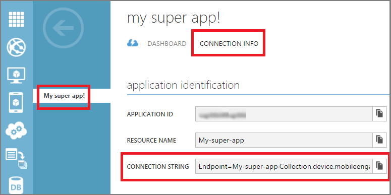

1. Accedere al [Portale classica Azure](https://manage.windowsazure.com)e quindi fare clic su **+ Nuovo** nella parte inferiore dello schermo.

2. Fare clic su **servizi di App**, quindi **impegno per dispositivi mobili**e quindi **creare**.

    

3. Nella finestra popup che viene visualizzata, immettere le informazioni seguenti:

    

    - **Nome dell'applicazione**: nome dell'applicazione. 
    - **Piattaforma**: piattaforma di destinazione per l'app. È necessario creare un'app Mobile impegno per piattaforme di destinazione per l'applicazione per dispositivi mobili. 
    - **Nome della risorsa applicazione**: nome per il quale sarà possibile accedere tramite API e URL dell'applicazione. 
    - **Posizione**: regione/Data center in cui verrà ospitate questa app e raccolta app.
    - **Raccolta**: selezionare un insieme creato in precedenza oppure selezionare 'Nuova raccolta'.
    - **Nome della raccolta**: rappresenta il gruppo delle applicazioni. In questo modo che tutte le applicazioni presenti in un gruppo per consentirà i calcoli aggregati di metriche. Utilizzare il nome della società o reparto qui se applicabile.

4. Selezionare l'app che appena creato nella scheda **applicazioni** .

5. Fare clic su **Informazioni di connessione** per visualizzare le impostazioni di connessione per inserire l'integrazione di SDK nell'app per dispositivi mobili.

6. Copiare la **Stringa di connessione** , in che cosa è necessario identificare l'app nel codice dell'applicazione e connettersi con coinvolgimento di dispositivi mobili dell'app.

    

