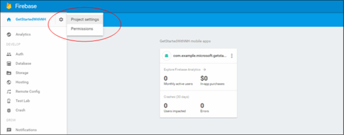

1. Accedere alla [console di Firebase](https://firebase.google.com/console/). Creare un nuovo progetto Firebase se non si dispone già uno.
2. Dopo aver creato il progetto fare clic su **Aggiungi Firebase all'app Android** e seguire le istruzioni fornite.

    

3. Nella Console di Firebase, fare clic su cog per il progetto e quindi fare clic su **Impostazioni di Project**.

    

4. Fare clic sulla scheda **Cloud messaggistica** nelle impostazioni del progetto e copiare il valore della **chiave di Server** e **ID mittente**.  Questi valori verranno utilizzati in un secondo momento per configurare l'hub di notifica criterio di accesso e il gestore di notifica nell'app.
  