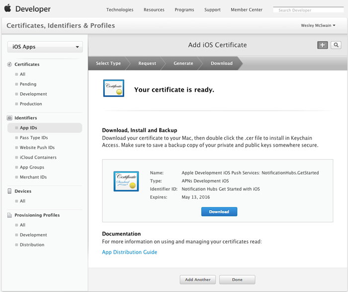
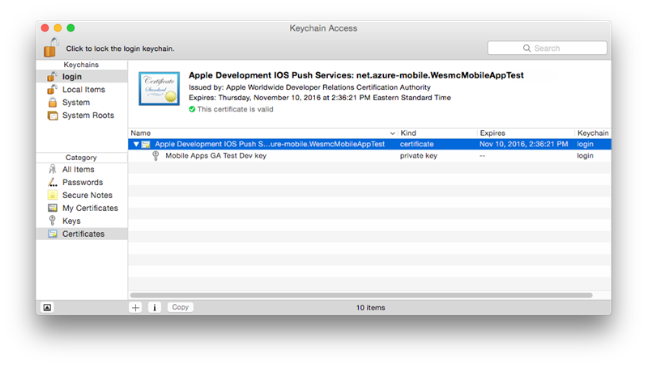

Per registrare l'app per le notifiche push tramite Apple Push Notification Service (APNS), è necessario creare un nuovo certificato push, l'ID di App e provisioning profilo per il progetto nel portale per sviluppatori di Apple. L'ID di App conterrà le impostazioni di configurazione che consentono l'app inviare e ricevere notifiche push. Queste impostazioni saranno incluso il certificato di notifica push necessario per l'autenticazione con Apple Push Notification Service (APN) durante l'invio e ricezione delle notifiche push. Per ulteriori informazioni su questi concetti vedere la documentazione di [Servizio di notifica Push di Apple](http://go.microsoft.com/fwlink/p/?LinkId=272584) ufficiale.

####Generare il file richiesta certificato di firma del certificato push

Questa procedura guidano l'utente nella creazione di richiesta di firma del certificato. Questa verrà utilizzata per generare un certificato push da utilizzare con APNS.

1. Nel Mac, eseguire lo strumento di accesso portachiavi. Può essere aperto dalla cartella **Utility** o nella **cartella nel riquadro degli strumenti Avvio** .

2. Fare clic su **Accesso Portachiavi**, espandere **Certificato Assistente**, quindi fare clic su **Richiedi un certificato emesso da un'autorità di certificazione...**.

    

3. Selezionare il proprio **Indirizzo di posta elettronica utente** e **Nome comune** , assicurarsi che sia selezionata **salvato su disco** e quindi fare clic su **Continua**. Lasciare vuoto il campo **Indirizzo di posta elettronica CA** come non è richiesto.

    

4. Digitare un nome per il file di certificato di firma richiedere (CSR) in **Salva con nome**, selezionare il percorso in **cui**, quindi fare clic su **Salva**.

    

    Consente di salvare il file CSR nel percorso selezionato. il percorso predefinito è sul desktop. Prendere nota del percorso scelto per il file.

####Registrare l'app per le notifiche push

Creare un nuovo ID App esplicita per l'applicazione di Apple e inoltre configurare per le notifiche push.  

1. Passare al [portale di Provisioning iOS](http://go.microsoft.com/fwlink/p/?LinkId=272456) al centro per sviluppatori Apple, accedere con l'ID Apple, fare clic su **identificatori**, quindi fare clic su **App ID**e infine fare clic sulla **+** accedere per registrare una nuova app.

    

2. Aggiornare i campi seguenti tre per la nuova app e quindi fare clic su **Continua**:

    * **Nome**: digitare un nome descrittivo per l'app nel campo **nome** nella sezione **App ID descrizione** .

    * **Identificatore globale**: nella sezione **ID App esplicito** immettere un **Identificatore di raggruppamento** nel modulo `<Organization Identifier>.<Product Name>` come indicato nella [Guida alla distribuzione di App](https://developer.apple.com/library/mac/documentation/IDEs/Conceptual/AppDistributionGuide/ConfiguringYourApp/ConfiguringYourApp.html#//apple_ref/doc/uid/TP40012582-CH28-SW8). Deve corrispondere cosa serve anche nel progetto XCode, Xamarin o Cordova per l'app.

    * **Notifiche push**: selezionare l'opzione **Notifiche Push** nella sezione dei **Servizi di App** .

    

3.  Nella schermata App ID di conferma, esaminare l'impostazione e dopo aver verificato loro fare clic su **Invia**

4.  Dopo avere inviato il nuovo ID di App, si vedrà la schermata di **registrazione completata** . Fare clic su **Chiudi**.

5. Nell'interfaccia di sviluppo, in App ID, individuare l'ID di app appena creata e fare clic su nella riga corrispondente. Facendo clic sulla riga ID app verranno visualizzati i dettagli dell'app. Fare clic sul pulsante **Modifica** nella parte inferiore.

6. Scorrere verso il basso della schermata e fare clic sul pulsante **Crea certificato** nella sezione **Sviluppo Push il certificato SSL**.

    

    Verrà visualizzata l'Assistente "Aggiungi iOS certificato".

    > [AZURE.NOTE] In questa esercitazione utilizza un certificato di sviluppo. Lo stesso processo viene utilizzato per la registrazione di un certificato di produzione. Assicurarsi di usare lo stesso tipo di certificato per l'invio di notifiche.

7. Fare clic su **Selezionare il File**, passare al percorso in cui è stato salvato il rappresentante del servizio per il certificato di push. Fare clic su **Genera**.

    

8. Una volta creato il certificato dal portale, fare clic sul pulsante **Scarica** .

    

    Verrà scaricato il certificato di firma e salvarlo nel computer in uso nella cartella download.

    

    > [AZURE.NOTE] Per impostazione predefinita, il file scaricato un certificato di sviluppo denominato **aps_development.cer**.

9. Fare doppio clic sui certificati push scaricati **aps_development.cer**. Si installa il nuovo certificato nel portachiavi di, come illustrato di seguito:

    

    > [AZURE.NOTE] Il nome del certificato potrebbe essere diverso, ma verrà preceduto **sviluppo Apple iOS Push servizi:**.

10. In accesso portachiavi, fare clic il nuovo certificato push appena creato nella categoria **certificati** . Fare clic su **Esporta**, assegnare un nome di file, selezionare il formato **p12** e quindi fare clic su **Salva**.

    Tenere presente il nome del file e il percorso del certificato push p12 esportato. Da utilizzare per abilitare l'autenticazione con APN caricandolo nel portale classica di Azure.

####Creare un profilo di provisioning per l'app

1. Nel <a href="http://go.microsoft.com/fwlink/p/?LinkId=272456" target="_blank">portale di Provisioning iOS</a>, selezionare **Il Provisioning di profili**, selezionare **tutto**e quindi fare clic sul **+** pulsante per creare un nuovo profilo. Verrà avviata la procedura guidata **Aggiungi iOS Provisiong profilo**

    

2. Selezionare **lo sviluppo di App iOS** in **fase di sviluppo** come tipo di profilo provisiong e fare clic su **Continua**.

3. Successivamente, selezionare l'ID di app appena creato dall'elenco a discesa **ID App** e fare clic su **Continua**

    

4. Nella schermata **selezionare certificati** , selezionare il certificato di sviluppo utilizzato per la firma del codice e fare clic su **Continua**. Si tratta di un certificato di firma, non il certificato di push appena creato.

    

5. Quindi selezionare **dispositivi** da utilizzare per il testing e fare clic su **Continua**

    

6. Infine, selezionare un nome per il profilo nella **Casella Nome profilo**, fare clic su **Genera**.

    
