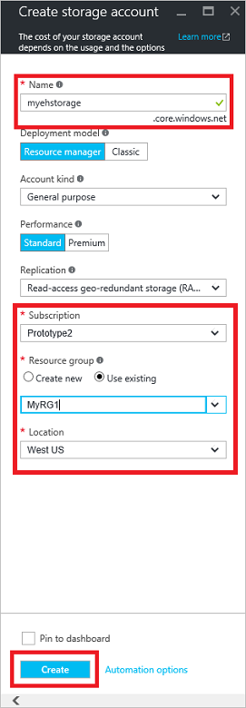

## <a name="receive-messages-with-eventprocessorhost"></a>Ricevere messaggi con EventProcessorHost

[EventProcessorHost][] è una classe .NET che semplifica ricevere gli eventi da hub di evento per la gestione dei punti di controllo permanenti e parallelo ricevuto tali hub evento. Usa [EventProcessorHost][], è possibile dividere eventi tra più destinatari, anche quando ospitato in nodi diversi. In questo esempio viene illustrato come utilizzare [EventProcessorHost][] per un singolo destinatario. Esempio [di elaborazione scala all'evento][] viene illustrato come utilizzare [EventProcessorHost][] con più destinatari.

Per usare [EventProcessorHost][], è necessario disporre di un [account di archiviazione di Azure][]:

1. Accedere al [portale di Azure][]e fare clic su **Nuovo** nella parte superiore sinistra dello schermo.

2. Fare clic su **dati + spazio di archiviazione**, quindi fare clic su **account di archiviazione**.

    

3. In e il **creare account di archiviazione** , digitare un nome per l'account di archiviazione. Scegliere un abbonamento Azure, gruppo di risorse e il percorso in cui si desidera creare la risorsa. Fare clic su **Crea**.

    

4. Nell'elenco degli account di archiviazione, fare clic sull'account di archiviazione appena creato.

5. Selezionare **i tasti di scelta**e il conto dello spazio di archiviazione. Copiare il valore di **chiave1** usare più avanti in questa esercitazione.

    

4. In Visual Studio, creare un nuovo progetto di Visual c# Desktop App utilizzando il modello di progetto **Applicazione Console** . Nome del progetto **ricevitore**.

    

5. In Esplora soluzioni fare doppio clic la soluzione e quindi fare clic su **Gestisci pacchetti NuGet per soluzione**.

6. Fare clic sulla scheda **Sfoglia** , quindi cercare `Microsoft Azure Service Bus Event Hub - EventProcessorHost`. Assicurarsi che il nome del progetto (**ricevitore**) nella casella **versioni** . Fare clic su **installazione**e accettare le condizioni di utilizzo.

    

    Visual Studio download, installazione e aggiunge un riferimento a [Azure servizio Bus evento Hub - pacchetto EventProcessorHost NuGet](https://www.nuget.org/packages/Microsoft.Azure.ServiceBus.EventProcessorHost), con tutte le relative dipendenze.

7. Fare clic sul progetto **ricevitore** , fare clic su **Aggiungi**e quindi fare clic su **classe**. Denominare la nuova classe **SimpleEventProcessor**e quindi fare clic su **Aggiungi** per creare la classe.

    

8. Nella parte superiore del file SimpleEventProcessor.cs, aggiungere le istruzioni seguenti:

    ```
    using Microsoft.ServiceBus.Messaging;
    using System.Diagnostics;
    ```

    Sostituire il codice riportato di seguito per il corpo del corso:

    ```
    class SimpleEventProcessor : IEventProcessor
    {
        Stopwatch checkpointStopWatch;

        async Task IEventProcessor.CloseAsync(PartitionContext context, CloseReason reason)
        {
            Console.WriteLine("Processor Shutting Down. Partition '{0}', Reason: '{1}'.", context.Lease.PartitionId, reason);
            if (reason == CloseReason.Shutdown)
            {
                await context.CheckpointAsync();
            }
        }

        Task IEventProcessor.OpenAsync(PartitionContext context)
        {
            Console.WriteLine("SimpleEventProcessor initialized.  Partition: '{0}', Offset: '{1}'", context.Lease.PartitionId, context.Lease.Offset);
            this.checkpointStopWatch = new Stopwatch();
            this.checkpointStopWatch.Start();
            return Task.FromResult<object>(null);
        }

        async Task IEventProcessor.ProcessEventsAsync(PartitionContext context, IEnumerable<EventData> messages)
        {
            foreach (EventData eventData in messages)
            {
                string data = Encoding.UTF8.GetString(eventData.GetBytes());

                Console.WriteLine(string.Format("Message received.  Partition: '{0}', Data: '{1}'",
                    context.Lease.PartitionId, data));
            }

            //Call checkpoint every 5 minutes, so that worker can resume processing from 5 minutes back if it restarts.
            if (this.checkpointStopWatch.Elapsed > TimeSpan.FromMinutes(5))
            {
                await context.CheckpointAsync();
                this.checkpointStopWatch.Restart();
            }
        }
    }
    ```

    Questa classe verrà chiamata da **EventProcessorHost** per elaborare gli eventi ricevuto dall'Hub evento. Si noti che la `SimpleEventProcessor` classe utilizza un cronometro per chiamare periodicamente il metodo di verifica al contesto **EventProcessorHost** . In questo modo che, se si riavvia il ricevitore, verranno perse non più di cinque minuti per l'elaborazione di lavoro.

9. In classe **programma** aggiungere quanto segue `using` istruzione nella parte superiore del file:

    ```
    using Microsoft.ServiceBus.Messaging;
    ```

    Quindi, sostituire il `Main` metodo la `Program` classe con il codice seguente, sostituendo il nome dell'evento Hub e la stringa di connessione a livello di spazio dei nomi che è stato salvato in precedenza, e l'account di archiviazione e chiave che sono stati copiati nelle sezioni precedenti. 

    ```
    static void Main(string[] args)
    {
      string eventHubConnectionString = "{Event Hub connection string}";
      string eventHubName = "{Event Hub name}";
      string storageAccountName = "{storage account name}";
      string storageAccountKey = "{storage account key}";
      string storageConnectionString = string.Format("DefaultEndpointsProtocol=https;AccountName={0};AccountKey={1}", storageAccountName, storageAccountKey);

      string eventProcessorHostName = Guid.NewGuid().ToString();
      EventProcessorHost eventProcessorHost = new EventProcessorHost(eventProcessorHostName, eventHubName, EventHubConsumerGroup.DefaultGroupName, eventHubConnectionString, storageConnectionString);
      Console.WriteLine("Registering EventProcessor...");
      var options = new EventProcessorOptions();
      options.ExceptionReceived += (sender, e) => { Console.WriteLine(e.Exception); };
      eventProcessorHost.RegisterEventProcessorAsync<SimpleEventProcessor>(options).Wait();

      Console.WriteLine("Receiving. Press enter key to stop worker.");
      Console.ReadLine();
      eventProcessorHost.UnregisterEventProcessorAsync().Wait();
    }
    ```

> [AZURE.NOTE] In questa esercitazione viene utilizzata una singola istanza [EventProcessorHost][]. Per aumentare la velocità, è consigliabile eseguire più istanze di [EventProcessorHost][], come illustrato nell'esempio [scala all'elaborazione dell'evento][] . In questi casi, le varie istanze automaticamente coordinano con un'altra per il bilanciamento del carico gli eventi ricevuti. Se si vuole più ricevitori di ogni processo *tutti* gli eventi, è necessario utilizzare il concetto di **ConsumerGroup** . Quando si riceve eventi da computer diversi, potrebbe essere utile per specificare i nomi degli [EventProcessorHost][] istanze basate su computer (o ruoli) in cui vengono distribuite. Per ulteriori informazioni su questi argomenti, vedere gli argomenti di [Evento hub Panoramica][] ed [Evento hub Programming Guide][] .

<!-- Links -->
[Cenni preliminari sui hub di eventi]: ../articles/event-hubs/event-hubs-overview.md
[Hub evento programmazione manuale]: ../articles/event-hubs/event-hubs-programming-guide.md
[Scalabilità elaborazione dell'evento]: https://code.msdn.microsoft.com/Service-Bus-Event-Hub-45f43fc3
[Account di archiviazione Azure]: ../articles/storage/storage-create-storage-account.md
[EventProcessorHost]: http://msdn.microsoft.com/library/azure/microsoft.servicebus.messaging.eventprocessorhost(v=azure.95).aspx
[Portale di Azure]: https://portal.azure.com