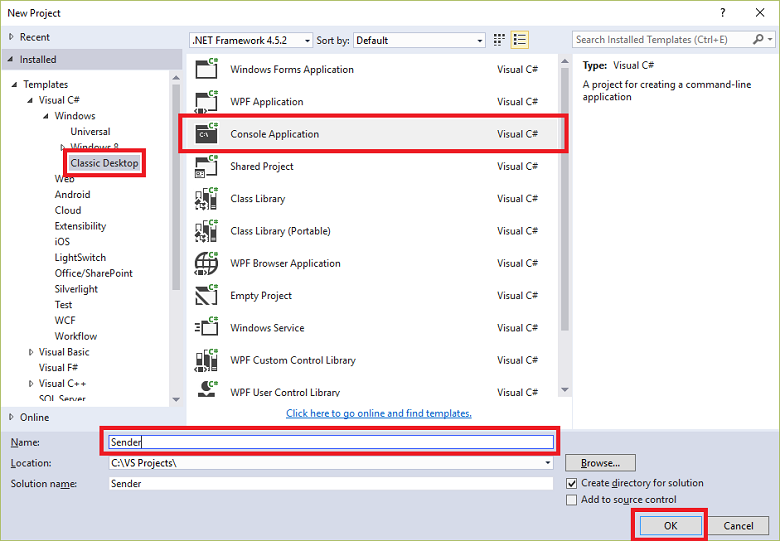

## <a name="send-messages-to-event-hubs"></a>Inviare messaggi a un hub di evento

In questa sezione, è necessario scrivere un'app di console di Windows che invia gli eventi per l'Hub di evento.

1. In Visual Studio, creare un nuovo progetto di Visual c# Desktop App utilizzando il modello di progetto **Applicazione Console** . Nome del progetto **mittente**.

    

2. In Esplora soluzioni fare doppio clic la soluzione e quindi fare clic su **Gestisci pacchetti NuGet per soluzione**. 

3. Fare clic sulla scheda **Sfoglia** , quindi cercare `Microsoft Azure Service Bus`. Assicurarsi che il nome del progetto (**mittente**) nella casella **versioni** . Fare clic su **installazione**e accettare le condizioni di utilizzo. 

    

    Visual Studio Scarica, installa e aggiunge un riferimento a [pacchetto NuGet raccolta Bus di servizio Azure](https://www.nuget.org/packages/WindowsAzure.ServiceBus).

4. Aggiungere quanto segue `using` le istruzioni nella parte superiore del file **Program.cs** :

    ```
    using System.Threading;
    using Microsoft.ServiceBus.Messaging;
    ```

5. Aggiungere i campi seguenti alla classe **Program** , sostituendo i valori segnaposto con il nome dell'evento Hub creata nella sezione precedente e la stringa di connessione a livello di spazio dei nomi che è stato salvato in precedenza.

    ```
    static string eventHubName = "{Event Hub name}";
    static string connectionString = "{send connection string}";
    ```

6. Aggiungere il metodo seguente alla classe **Program** :

    ```
    static void SendingRandomMessages()
    {
        var eventHubClient = EventHubClient.CreateFromConnectionString(connectionString, eventHubName);
        while (true)
        {
            try
            {
                var message = Guid.NewGuid().ToString();
                Console.WriteLine("{0} > Sending message: {1}", DateTime.Now, message);
                eventHubClient.Send(new EventData(Encoding.UTF8.GetBytes(message)));
            }
            catch (Exception exception)
            {
                Console.ForegroundColor = ConsoleColor.Red;
                Console.WriteLine("{0} > Exception: {1}", DateTime.Now, exception.Message);
                Console.ResetColor();
            }

            Thread.Sleep(200);
        }
    }
    ```

    Questo metodo invia continuamente eventi per l'Hub di evento con un ritardo di 200 ms.

7. Infine, aggiungere le seguenti righe al metodo **principali** :

    ```
    Console.WriteLine("Press Ctrl-C to stop the sender process");
    Console.WriteLine("Press Enter to start now");
    Console.ReadLine();
    SendingRandomMessages();
    ```
