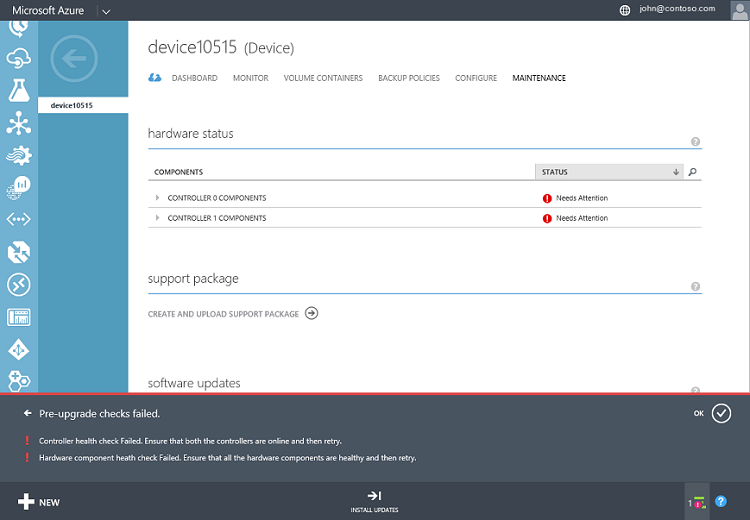
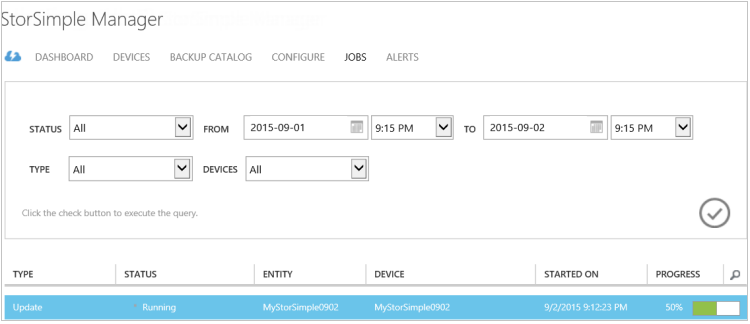
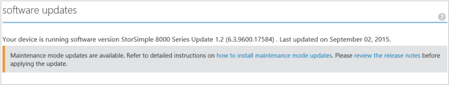

<!--author=SharS last changed: 01/15/2016-->

#### Per installare l'aggiornamento 1.2 dal portale di classica Azure

1. Nella pagina servizio StorSimple, selezionare il dispositivo. Passare a **dispositivi** > **manutenzione**.

2. Nella parte inferiore della pagina, fare clic su **Analisi aggiornamenti**. Verrà creato un processo per rilevare gli aggiornamenti disponibili. Verrà avvertiti il processo è stata completata.

3. Nella sezione **Degli aggiornamenti Software** nella stessa pagina, si vedrà che sono disponibili nuovi aggiornamenti software. È consigliabile esaminare le note sulla versione prima di applicare aggiornamento 1.2 nel dispositivo.

    

4. Nella parte inferiore della pagina, fare clic su **Installa aggiornamenti**.

5. Verrà richiesto di confermare l'operazione. Fare clic su **OK**.

6. Verrà visualizzata la finestra di dialogo **Installa aggiornamenti** . Il dispositivo deve soddisfare i controlli elencati in questa finestra di dialogo. Questa procedura sono stata completata prima dell'aggiornamento. Selezionare **I comprendere il requisito sopra e pronto per l'aggiornamento del dispositivo**. Fare clic sull'icona di controllo.

    

7. A questo punto inizierà a un set di pre-controlli automatici. Sono inclusi:

    - **Verifica dell'integrità controller** per verificare che entrambi i controller di dispositivo siano corretti e online.
    
    - **Verifica dell'integrità di componenti hardware** per verificare che tutti i componenti hardware sul dispositivo StorSimple siano corretti.
    
    - **Controlla dati 0** per verificare che i dati 0 sono attivati nel dispositivo. Se questa interfaccia non è attivata, sarà necessario attivarlo e quindi riprovare.
    
    - **Controlla dati 2 e 3 di dati** per verificare che le interfacce di rete dati 2 e 3 di dati non sono attivate. Se queste interfacce siano abilitate, sarà necessario disattivarli e quindi provare ad aggiornare il dispositivo. Questo controllo viene eseguito solo se si sta aggiornando un dispositivo che esegue GA. Questo controllo non è necessario dispositivi che eseguono versioni 0,1, 0,2 o 0,3.
    
    - **Gateway verificare** in qualsiasi dispositivo in esecuzione una versione precedente aggiornamento 1. Questo controllo viene eseguito in tutto il dispositivo che esegue pre-aggiornamento 1 ma non riesce nei dispositivi che sono configurato per l'interfaccia di rete diversa da quella dati 0 un gateway.
 
    Aggiornamento 1.2 verrà applicato solo se tutti i controlli pre-aggiornamento precedenti vengono eseguiti correttamente. L'utente verrà informato che i controlli di pre-aggiornamento sono in corso.
  
    

    Di seguito è illustrato un esempio in cui il controllo pre-aggiornamento non è riuscita. È necessario verificare che entrambi i controller di dispositivo siano corretti e online. Sarà anche necessario verificare l'integrità dei componenti hardware. In questo esempio, Controller 0 e 1 Controller componenti richiedono un'attenzione. Potrebbe essere necessario contattare il supporto Microsoft se non è possibile risolvere questi problemi personalmente.

     

    > [AZURE.NOTE] Dopo aver applicato aggiornamento 1.2 sul dispositivo StorSimple, controlli dati 2 e 3 di dati e la verifica di gateway non saranno necessarie per aggiornamenti futuri. Gli altri pre-controlli saranno necessari.

8. Dopo i controlli pre-aggiornamento vengono eseguiti correttamente, verrà creato un processo di aggiornamento. Verrà avvertiti il processo di aggiornamento è stato creato correttamente.
 
    

    L'aggiornamento quindi essere applicato nel dispositivo.
 
9. Per controllare lo stato di avanzamento del processo di aggiornamento, fare clic su **Visualizza processo**. Nella pagina **dei processi** , è possibile visualizzare lo stato di avanzamento di aggiornamento. 

    

10. L'aggiornamento verrà richiedere alcune ore per completare. È possibile visualizzare i dettagli del processo in qualsiasi momento.

    

11. Una volta completato il processo, passare alla pagina **manutenzione** e scorrere fino a **Aggiornamenti Software**.

12. Verificare che il dispositivo sia in esecuzione **StorSimple 8000 serie aggiornamento 1.2 (6.3.9600.17584)**. **Ultimo aggiornamento data** devono essere modificati.

    

13. Vedrete che gli aggiornamenti in modalità di manutenzione sono disponibili. Gli aggiornamenti sono gli aggiornamenti dannosi risultato del tempo di inattività dispositivo e possono essere applicati solo tramite l'interfaccia di Windows PowerShell del dispositivo. Seguire le istruzioni in [installare gli aggiornamenti in modalità di manutenzione](storsimple-update-device.md#install-maintenance-mode-updates-via-windows-powershell-for-storsimple) per installare questi aggiornamenti tramite Windows PowerShell per StorSimple.

> [AZURE.NOTE] In alcuni casi, visualizzato il messaggio che indica che sono disponibili aggiornamenti in modalità di manutenzione di 24 ore dopo che gli aggiornamenti in modalità di manutenzione vengono applicati correttamente sul dispositivo.  

